[java数据结构与算法——动力节点24课程传送门->b站](https://www.bilibili.com/video/BV1tU411U7SF?p=1&vd_source=796ed40051b301bfa3a84ba357f4828c)

# Ⅰ. 数据结构和算法概述

## 一. 数据结构和算法介绍

***算法*:**

算法是指解题方案的准确而完整的描述， 是一系列解决问题的清晰指令， 算法代表着用系统的方法描述解决问题的策略机制。 也就是说， 能够对一定规范的输入， 在有限时间内获得所要求的输出。 如果一个算法有缺陷， 或不适合于某个问题， 执行这个算法将不会解决这个问题。 不同的算法可能用不同的时间、 空间或效率来完成同样的任务。 一个算法的优劣可以用空间复杂度与时间复杂度来衡量。算法是独立存在的一种解决问题的方法和思想。对于算法而言， 实现的语言并不重要， 重要的是思想。

我们可以用不同的算法解决相同的问题， 而不同的算法的成本也是不相同的。 

总体上， **一个优秀的算法追求以下两个目标**:

1. 花最少的时间完成需求
2. 占用最少的内存空间完成需求

***数据结构*:**

数据结构就是把数据组织起来， 为了更方便地使用数据我们为了解决问题， 需要将数据保存下来， 然后根据数据的存储方式来设计算法实现进行处理， 那么数据的存储方式不同就会导致需要不同的算法进行处理。 我们希望算法解决问题的效率越快越好， 于是我们就需要考虑数据究竟如何保存的问题， 这就是数据结构。

数据结构是计算机存储、 组织数据的方式。 数据结构是指相互之间存在一种或多种特定关系的数据元素的集合。  

## 二. 数据结构分类

传统上， 我们可以把数据结构分为逻辑结构和物理结构两大类。 

### 1. 逻辑结构

逻辑结构是从具体问题中抽象出来的模型， 是抽象意义上的结构， 按照对象中数据元素之间的相互关系分类， 也是我们后面课题中需要关注和讨论的问题。

1. ***集合结构***:集合结构中数据元素除了属于同一个集合外， 他们之间没有任何其他的关系。
   
   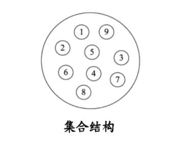
2. ***线性结构***:线性结构中的数据元素之间存在一对一的关系 
   
   
3. ***树形结构***:树形结构中的数据元素之间存在一对多的层次关系
   
   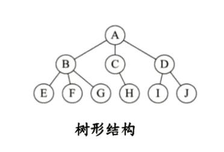
4. ***图形结构***:图形结构的数据元素是多对多的关系
   
   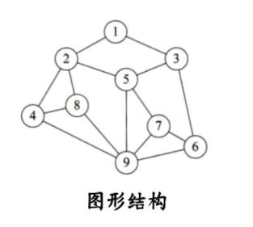

### 2. 物理结构

逻辑结构在计算机中真正的表示方式(又称为映像)称为物理结构， 也可以叫做存储结构。 常见的物理结构有顺序存储结构、 链式存储结构。

1. ***顺序存储结构***:把数据元素放到地址连续的存储单元里面， 其数据间的逻辑关系和物理关系是一致的， 比如我们常用的数组就是顺序存储结构。
   
   
   
   顺序存储结构存在一定的弊端,就像生活中排时也会有人插队也可能有人有特殊情况突然离开， 这时候整个结构都处于变化中， 此时就需要链式存储结构。
2. ***链式存储结构***:是把数据元素存放在任意的存储单元里面,这组存储单元可以是连续的也可以是不连续的。 此时， 数据元素之间并不能反映元素间的逻辑关系， 因此在链式存储结构中引进了一个指针存放数据元素的地址， 这样通过地址就可以找到相关联数据元素的位置
   
   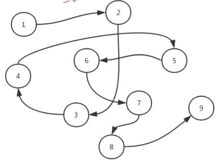

### 线性结构和非线性结构

***线性结构***

- 线性结构作为最常用的数据结构， 其特点是数据元素之间存在一对一的线性关系。
- 线性结构有两种不同的存储结构， 即顺序存储结构(数组)和链式存储结构(链表)。顺序存储的线性表称为顺序表， 顺序表中的存储元素是连续的。
- 链式存储的线性表称为链表， 链表中的存储元素不一定是连续的， 元素结点存放数据元素以及相邻元素的地址信息。
- 线性结构常见的有： 数组、 队列、 链表和栈


***非线性结构***

二维数组， 多维数组， 广义表， 树结构， 图结构。

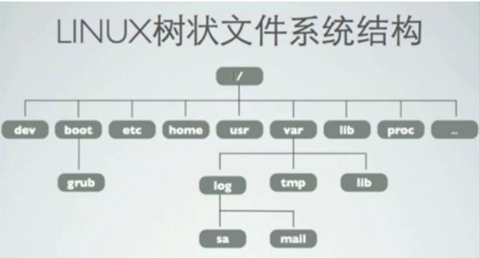

# Ⅱ. 时间和空间复杂度  

## 一. 时间和空间复杂度分析

### 时间复杂度分析

我们要计算算法时间耗费情况， 首先我们得度量算法的执行时间：

***郭后分析估算方法*:**

比较容易想到的方法就是我们把算法执行若干次， 然后拿个计时器在旁边计时， 这种事后统计的方法看上去的确不错， 并且也并非要我们真的拿个计算器在旁边计算， 因为计算机都提供了计时的功能。 这种统计方法主要是通过设计好的测试程序和测试数据,利用计算机计时器对不同的算法编制的程序的运行时间进行比较， 从而确定算法效率的高低， 但是这种方法有很大的缺陷:必须依据算法实现编制好的测试程序， 通常要花费大量时间和精力， 测试完了如果发现测试的是非常糟糕的算法， 那么之前所做的事情就全部白费了,并且不同的测试环境(硬件环境)的差别导致测试的结果差异也很大。

***事前分析估算方法*:**

在计算机程序编写前， 依据统计方法对算法进行估算， 经过总结， 我们发现**一个高级语言编写的程序程序在计算机上运行所消耗的时间取决于下列因素**:

1. 算法采用的策略和方案
2. 编译产生的代码质量
3. 问题的输入规模(所谓的问题输入规模就是输入量的多少)
4. 机器执行指令的速度

***分析：***

由此可见， 抛开这些与计算机硬件、 软件有关的因素， 一个程序的运行时间依赖于算法的好坏和问题的输入规模。 如果算法固定， 那么该算法的执行时间就只和问题的输入规模有关系了。我们再次以之前的求和案例为例， 进行分析。

**需求**:计算 1 到 100 的和。

**解法:**


上面这个例子中， 如果我们要精确的研究循环的条件执行了多少次， 是一件很麻烦的事情， 并且， 由于真正计算和代码内循环的循环体， 所以， 在**研究算法的效率时**， 我们**只考虑核心代码的执行次数**， 这样可以简化分析。我们研究算法复杂度， **侧重的是当输入规模不断增大时， 算法的增长量的一个抽象(规律)**， 而不是精确地定位需要执行多少次， 因为如果是这样的话， 我们又得考虑回编译期优化等问题，容易主次跌倒。  

我们不关心编写程序所用的语言是什么， 也不关心这些程序将跑在什么样的计算机上， 我们只关心它所实现的算法。 这样， 不计那些循环索引的递增和循环终止的条件、 变量声明、 打印结果等操作， 最终在分析程序的运行时间时， 最重要的是把程序看做是独立于程序设计语言的算法或一系列步骤。 **我们分析一个算法的运行时间， 最重要的就是把核心操作的次数和输入规模关联起来**。  

---

***函数渐近增长概念***:
给定两个函数 $f(n)$和 $g(n)$,如果存在一个整数 $N$， 使得对于所有的 $n>N$,$f(n)$总是比 $g(n)$大， 那么我们说 $f(n)$的增长渐近快于 $g(n)$。 概念似乎有点艰涩难懂， 那接下来我们做几个测试。


### 时间复杂度测试一

**随着输入规模的增大， 算法的常数操作可以忽略不计**

假设四个算法的输入规模都是 n:

1. 算法 A1 要做 $2n+3$ 次操作,可以这么理解:先执行 $n $次循环,执行完毕后， 再有一个 $n $次循环，最后有 $3$ 次运算
2. 算法 A2 要做 $2n $次操作
3. 算法 B1 要做 $3n+1$ 次操作,可以这个理解:先执行 $n $次循环， 再执行一个 $n$ 次循环， 再执行一个 n 次循环， 最后有 1 次运算。
4. 算法 B2 要做 $3n$ 次操作;  

那么， 上述算法， 哪一个更快一些呢?  

| 输入规模 | 算法A1($2n+3$)执行次数 | 算法A2($2n$)执行次数 | 算法B1($3n+1$)执行次数 | 算法B2($3n$)执行次数 |
| -------- | ---------------------- | -------------------- | ---------------------- | -------------------- |
| n=1      | 5                      | 2                    | 4                      | 3                    |
| n=2      | 7                      | 4                    | 7                      | 6                    |
| n=3      | 9                      | 6                    | 10                     | 9                    |
| n=10     | 23                     | 20                   | 31                     | 30                   |
| n=100    | 203                    | 200                  | 301                    | 300                  |

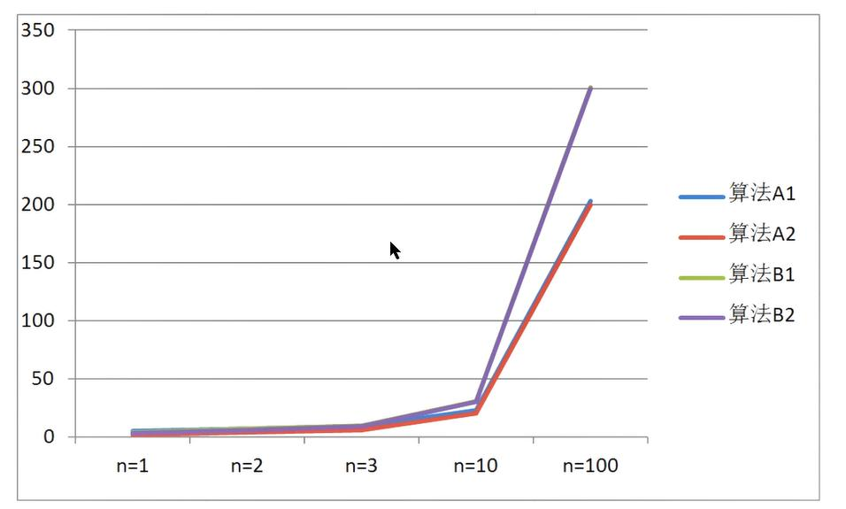

通过数据表格， 比较算法 A1 和算法 B1:

- 当输入规模 $ n=1 $时， A1 需要执行 5 次， B1 需要执行 4 次， 所以 A1 的效率比 B1 的效率低
- 当输入规模 $n=2 $时， A1 需要执行 7 次， B1 需要执行 7 次， 所以 A1 的效率和 B1 的效率一样
- 当输入规模 $n>2$ 时， A1 需要的执行次数一直比 B1 需要执行的次数少， 所以 A1 的效率比 B1的效率高

**所以我们可以得出结论**:
当输入规模 n>2 时， 算法 A1 的渐近增长小于算法 B1 的渐近增长
通过观察折线图， 我们发现,随着输入规模的增大,算法 A1 和算法 A2 逐渐重叠到一块,算法 B1和算法 B2 逐渐重叠到一块， 所以我们得出结论:**随着输入规模的增大， 算法的常数操作可以忽略不计**

### 时间复杂度测试二

**随着输入规模的增大,与最高次项相乘的常数可以忽略**

假设四个算法的输入规模都是n:

1. 算法C1需要做$4n+8$次操作
2. 算法C2需要做$n$次操作
3. 算法D1需要做$2n^2$次操作
4. 算法D2需要做$n^2$次操作

那么上述算法，哪个更快一些？

| 输入规模 | 算法C1($4n+8$)执行次数 | 算法C2($n$)执行次数 | 算法D1($2n^2$)执行次数 | 算法D2($n^2$)执行次数 |
| -------- | ---------------------- | ------------------- | ---------------------- | --------------------- |
| n=1      | 12                     | 1                   | 3                      | 1                     |
| n=2      | 16                     | 2                   | 9                      | 4                     |
| n=3      | 20                     | 3                   | 19                     | 9                     |
| n=10     | 48                     | 10                  | 201                    | 100                   |
| n=100    | 408                    | 100                 | 20001                  | 10000                 |
| n=1000   | 4008                   | 1000                | 2000001                | 1000000               |


通过数据表格， 对比算法 C1 和算法 D1:

- 当输入规横 $n\leqslant3 $时， 算法 C1 执行次数多于算法 D1， 因此算法 C1 效率低一些
- 当输入规模 $n>3 $时， 算法 C1 执行次数少于算法 D1， 因此算法 D2 效率低一些，

所以， 总体上,算法 C1 要优于算法 D1

通过折线图， 对比对比算法 C1 和 C2:
随着输入规模的增大， 算法 C1 和算法 C2 几乎重叠

通过折线图， 对比算法 C 系列和算法 D 系列:
随着输入规模的增大， 即使去除 n^2 前面的常数因子， D 系列的次数要远远高于 C 系列。

因此， 可以得出结论:**随着输入规模的增大,与最高次项相乘的常数可以忽略**

### 时间复杂度测试三

**最高次项的指数大的， 随着 n 的增长， 结果也会变得增长特别快**

假设四个算法的输入规模都是 n:

- 算法 E1:$2n^2+3n+1$;
- 算法 E2:$n^2$
- 算法 F1:$2n^3+3n+1$
- 算法 F2:$n^3$

那么上述算法， 哪个更快一些?

| 输入规模 | 算法E1($2n^2+3n+1$)执行次数 | 算法E2($n^2$)执行次数 | 算法F1($2n^3+3n+1$)执行次数 | 算法F2($n^3$)执行次数 |
| -------- | --------------------------- | --------------------- | --------------------------- | --------------------- |
| n=1      | 6                           | 1                     | 6                           | 1                     |
| n=2      | 15                          | 4                     | 23                          | 8                     |
| n=3      | 28                          | 9                     | 64                          | 27                    |
| n=10     | 231                         | 100                   | 2031                        | 1000                  |
| n=100    | 20301                       | 10000                 | 2000301                     | 1000000               |


通过数据表格、 对比算法 E1 和算法 F1:

- 当 $n=1$ 町、 算法 1 和算法 F1 的执行次数一样
- 当 $n>1$ 时， 算法 E1 的执行次数远远小于算法 F1 的执行次数

所以算法 E1 总体上是由于算法 F1 的。

通过折线图我们会看到， 算法 F 系列随着 n 的增长会变得特块， 算法 E 系列随着 n 的增长相比较算法 F 来说， 变得比较慢，
所以可以得出结论:**最高次项的指数大的， 随着 n 的增长， 结果也会变得增长特别快**

### 时间复杂度测试四

**算法函数中 n 最高次幂越小， 算法效率越高**

假设五个算法的输入规模都是 n:

- 算法 G:$n^3$
- 算法 H:$n^2$
- 算法 I: $n$
- 算法J: $\log n$
- 算法 K: $1$

那么上述算法， 哪个效率更高呢?

| 输入规模 | 算法 G($n^3$)执行次数 | 算法H($n^2$)执行次数 | 算法I($n$)执行次数 | 算法J( $\log n$)执行次数 | 算法 K($1$) |
| -------- | --------------------- | -------------------- | ------------------ | ------------------------ | ----------- |
| n=2      | 8                     | 4                    | 2                  | 1                        | 1           |
| n=4      | 64                    | 16                   | 4                  | 2                        | 1           |

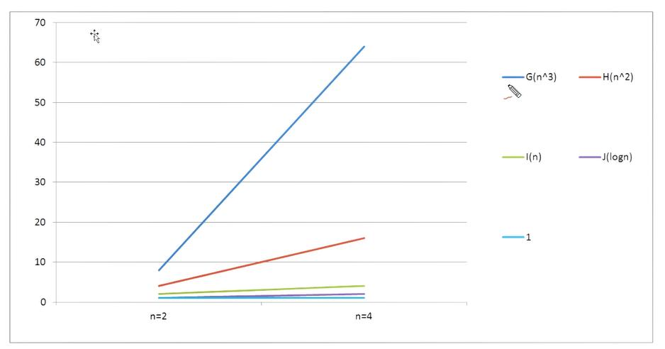

通过观察数据表格和折线图。 很容易可以得出结论的:**算法函数中 n 最高次幂越小， 算法效率越高**

### 时间复杂度规则总结

综上所述， 在我们比较算法随着输入规模的增长量时， 可以有以下规则: 

1. **算法函数中的常数可以忽略**
2. **算法函数中最高次幂的常数因子可以忽略**
3. **算法函数中最高次幂越小， 算法效率越高。**

## 二. 时间频度

***时间频度***： 一个算法花费的时间与算法中语句的执行次数成正比， 哪一个算法中语句执行次数多， 那么他所花费的时间就会多。 **一个算法中语句执行次数称之为语句频度或时间频度**。 记为 $T(n)  $

- **忽略常数项**
- **忽略低次项**
- **忽略系数**  

## 三. 算法时间复杂度

### 1. 大O记法

用大写 $O()$来体现算法时间复杂度的记法， 我们称之为**大 O 记法**。 

一般情况下， 随着输入规模$n $的增大， $T(n)$增长最慢的算法为最优算法。下面我们使用大 O 表示法来表示一些求和算法的时间复杂度:

如果忽略判断条件的执行次数和输出语句的执行次数， 那么当输入规模为 $n $时， 各算法执行的次数分别为:

- 算法一:$3 $次
- 算法二:$n+3 $次
- 算法三:$n^2+2 $次

如果用大 O 记法表示上述每个算法的时间复杂度， 应该如何表示呢?基于我们对函数渐近增长的分析， 推导==大 O 阶的表示法有以下几个**规则**==可以使用:

1. **用常数 1 取代运行时间中的所有加法常数**
2. **在修改后的运行次数中， 只保留高阶项**
3. **如果最高阶项存在， 且常数因子不为 1， 则去除与这个项相乘的常数**

所以， 上述算法的**大 O 记法分别为**:

- 算法一:$O(1)$
- 算法二:$O(n)$
- 算法三:$ O(n^2)$

### 2. 常见的大O阶

1. ***线性阶***：
   一般含有非嵌套循环涉及线性阶， 线性阶就是随着输入规模的扩大， 对应计算次数呈直线增长

   ```java
   int sum = 0;
   int n = 100;
   for (int i = 0; i <= n; i++) {
       sum += i;
   }
   System.out.println("sum=" + sum);
   ```

   上面这段代码， 它的循环的时间复杂度为 $O(n)$,因为循环体中的代码需要执行$ n $次  

2. 平方阶
   一般嵌套循环属于这种时间复杂度

   ```java
   int sum = 0, n = 100;
   for (int i = 1; i <= n; i++) {
       for (int j = 1; j <= n; j++) {
           sum+=i;
       }
   }
   System.out.println("sum=" + sum);
   ```

   上面这段代码， $n=100$， 也就是说， 外层循环每执行一次， 内层循环就执行 100 次， 那总共程序想要从这两个循环中出来， 就需要执行 $100\times100 $次， 也就是 $n$ 的平方次， 所以这段代码的时间复杂度是 $O(n^2)  $

3. 立方阶
   一般三层嵌套循环属于这种时间复杂度

   ```java
   int x = 0, n = 100;
   for (int i = 1; i <= n; i++) {
       for (int j = i; j <= n; j++) {
           for (j = i; j <= n ; j++) {
               x++;
           }
       }
   }
   System.out.println(x);
   ```

   上面这段代码， $n=100$， 也就是说， 外层循环每执行一次， 中间循环循环就执行 100 次， 中间循环每执行一次， 最内层循环需要执行 100 次， 那总共程序想要从这三个循环中出来， 就需要执行 100100100 次， 也就是 n 的立方， 所以这段代码的时间复杂度是 $O(n^3)  $

4. 对数阶

   ```java
   int i = 1, n = 100;
   while (i < n) {
       i = i * 2;
   }
   ```

   由于每次 $i\times2 $之后， 就距离 n 更近一步， 假设有 x 个 2 相乘后大于 n,则会退出循环。由于是 $2^x=n$,得到$ x=\log_2n$,所以这个循环的时间复杂度为 $O(\log n)$;
   **对于对数阶**， 由于随着输入规模 n 的增大， 不管底数为多少， 他们的增长趋势是一样的， 所以我们**会忽略底数**。

   

5. 常数阶

   ```java
   int n = 100;
   int i = n + 2;
   System.out.println(i);
   ```

   一般不涉及循环操作的都是常数阶、 因为它不会随着 n 的増长而増加操作次数。
   上述代码， 不管输入规模 n 是多少， 都执行 2 次， 根据大 0 推导法则， **常数用 1 来替换**， 所以上述代码的时间复杂度为 $O(1)$

==下面是对常见时间复杂度的一个总结:==

| 描述         | 增长的数量级 | 说明     | 举例           |
| :----------- | :----------- | :------- | :------------- |
| 常数级别     | $1$          | 普通语句 | 两数相加       |
| 对数级别     | $\log n$     | 二分策略 | 二分查找       |
| 线性级别     | $n$          | 循环     | 找最大元素     |
| 线性对数级别 | $n\log n$    | 分治思想 | 归并排序       |
| 平方级别     | $n^2$        | 双层循环 | 检查所有元素对 |
| 立方级别     | $n^3$        | 三层循环 | 检查所有二元组 |
| 指数级别     | $2^n$        | 穷举查找 | 检查所有子集   |

他们的**复杂程度从低到高依次为: $O(1)<O(\log n)<O(n)<O(n\log n)<O(n^2)<O(n^3)$**

根据前面的折线图分析， 我们会发现， 从平方阶开始， 随着输入规模的增大， 时间成本会急剧增大， 所以， 我们的算法,尽可能的追求的是 $O(1),O(logn),O(n),O(nlogn)$这几种时间复杂度， 而如果发现算法的时间复杂度为平方阶、 立方阶或者更复杂的， 那我们可以分为这种算法是不可取的， 需要优化。

## 四. 函数调用的时间复杂度分析

**案例一：**

```java
public static void main(String[] args) {
    int n = 100;
    for (int i = 0; i < n; i++) {
        show(i);
    }
}
private static void show(int i) {
    System.out.println(i);
}
```

在 main 方法中， 有一个 for 循环， 循环体调用了 show 方法， 由于 show 方法内部只执行了一行代码， 所以 show 方法的时间复杂度为 $O(1)$,那 main 方法的时间复杂度就是 $O(n)  $

**案例二：**

```java
public static void main(String[] args) {
    int n = 100;
    for (int i = 0; i < n; i++) {
        show(i);
    }
}
private static void show(int i) {
    for (int j = 0; j < i; j++) {
        System.out.println(i);
    }
}
```

在 main 方法中， 有一个 for 循环， 循环体调用了 show 方法， 由于 show 方法内部也有一个 for循环， 所以 show 方法的时间复杂度为 $O(n)$,那 main 方法的时间复杂度为 $O(n^2)  $

**案例三：**

```java
public static void main(String[] args) {
    int n = 100;
    for (int i = 0; i < n; i++) {
        show(i);
    }
    for (int i = 0; i < n; i++) {
        for (int j = 0; j < n; j++) {
            System.out.println(j);
        }
    }
}
private static void show(int i) {
    for (int j = 0; j < i; j++) {
        System.out.println(i);
    }
}
```

在 show 方法中， 有一个 for 循环， 所以 show 方法的时间复杂度为 O(n),在 main 方法中， show(n)这行代码内部执行次数为 $n$， 第一个 for 循环内调用了 show 方法， 所以其执行次数为$ n^2$,第二个嵌套 for 循环内只执行了一行代码， 所以其执行次数为 $n^2$,那么 main 方法总执行次数为$n+n^2+n^2=2n^2+n$。 根据大 0 推导规则， 去掉$ n $保留最高阶项,并去掉最高阶项的常数因子 $2$，所以最终 main 方法的时间复杂度为 $O(n^2)  $

## 五. 平均和最坏时间复杂度

***平均时间复杂度***: 是指所有可能的输入实例均以等概率的出现情况下得到算法的运行时间

***最坏时间复杂度***: 一般讨论的时间复杂度均是最坏情况下的时间复杂度， 这样做的原因是最坏情况下的时间复杂度是算法在任何输入实例上运行的界限， 这就保证了算法的运行时间不会比最坏情况更长。

平均时间复杂度和最坏时间复杂度是否一样， 这就需要根据算法不同而不同了

| 排序算法     | 平均时间复杂度 | 最坏时间复杂度 | 空间复杂度  | 是否稳定 |
| ------------ | -------------- | -------------- | ----------- | -------- |
| 冒泡排序     | $O(n^2)$       | $O(n^2)$       | $O(1)$      | 是       |
| 选择排序     | $O(n^2)$       | $O(n^2)$       | $O(1)$      | 不是     |
| 直接插入排序 | $O(n^2)$       | $O(n^2)$       | $O(1)$      | 是       |
| 归并排序     | $O(n\log n)$   | $O(n\log n)$   | $O(n)$      | 是       |
| 快速排序     | $O(n\log n)$   | $O(n^2)$       | $O(\log n)$ | 不是     |
| 堆排序       | $O(n\log n)$   | $O(n\log n)$   | $O(1)$      | 不是     |
| 希尔排序     | $O(n\log n)$   | $O(n^2)$       | $O(1)$      | 不是     |
| 计数排序     | $O(n+k)$       | $O(n+k)$       | $O(n+k)$    | 是       |
| 基数排序     | $O(n\times m)$ | $O(n\times m)$ | $O(m)$      | 是       |

从心理学角度讲， 每个人对发生的事情都会有一个预期， 比如看到手机剩余 50%电量， 有人会说:哇哦， 还有一半的电量哦!但也有人会说:天哪， 只有一半电量了。 一般人处于一种对未来失败的担忧， 而在预期的时候趋向做最坏的打算,这样即使最糟糕的结果出现， 当事人也有了心理准备， 比较容易接受结果。 假如最糟糕的结果井没有出现， 当事人会很快乐。

eg:

```java
public int search(int num) {
    int[] arr={11, 10, 9, 6, 22, 23, 44};
    for (int i = 0; i < arr.length; i++) {
        if (num == arr[i]) {
            return i;
        }
    }
    return -1;
}
```

- 最好情况:
  查找的第一个数字就是期望的数字， 那么算法的时间复杂度为 $O(1)$
- 最坏情况;
  查找的最后一个数字,才是期望的数字， 那么算法的时间复杂度为$ O(n)$
- 平均情况:
  任何数字查找的平均成本是 $O(n/2)$

最坏情况是一种保证， 在应用中， 这是一种最基本的保障， 即使在最坏情况下， 也能够正常提供服务， 所以， 除非特别指定， 我们提到的运行时间都指的是最坏情况下的运行时间。

## 六. 算法的空间复杂度分析

1. **基本数据类型内存占用情况**：
   | 数据类型 | 内存占用字节数 |
   | -------- | -------------- |
   | byte     | 1              |
   | short    | 2              |
   | int      | 4              |
   | long     | 8              |
   | float    | 4              |
   | double   | 8              |
   | bollean  | 1              |
   | char     | 2              |

2. **计算机访问内存的方式都是一次一个字节**  
   

3. 一**个引(机器地址)需要 8 个字节表示**
   例如` Date date - new Date()`,Date 这个变量要占用 8 个字节来表示

4. 创建一个对象， 比如 `new Date()`， 除了 **Date 对象内部存储的数据**(例如年月日等信息)占用的内存， 该**对象本身也有内存开销， 每个对象的自身开销是 16 个字节**， 用来保存对象的头信息。

5. 一般内存的使用， **如果不够 8 个字节， 都会被自动填充为 8 字节**
   ```java
   public class A {// 对象本身占用16个字节
       public int a = 1;// 成员变量int类型a占用4个字节
   }
   ```

   通过`new A()`创建一个对象总共需要20个字节，但由于不是以8位单位，会自动填充位24个字节

6. java 中**数组被被限定为对象**， 他们一般都会因为记录长度而需要额外的内存， **一个原始数据类型的数组一般需要 24 字节的头信息(16 个自己的对象开销， 4 字节用于保存长度以及 4 个填充字节)再加上保存值所需的内存**。

## 七. 算法的空间复杂度

了解了java的内存最基本的机制，就能够有效帮助我们估计大量程序的内存使用情况。

算法的**空间复杂度计算公式**记作：$S(n)=O(f(n)$,其中n为输入规模，f(n)为语句关于n所占存储空间的函数。

案例：对指定的数组元素进行反转，并返回反转的内容。

解法一：

```java
public static int[] reversel(int[]arr){
    int n = arr.length;//申请4个字节 
    int temp;//申请4个字节 
        for(int start=0, end=n-1; start<=end; start++, end--){ 
            temp=arr[start]; 
            arr[start]=arr[end]; 
            arr[end]=temp;
        }
    return arr;
}
```

解法二： 

```java
public static int[] reverse2(int[]arr){ 
    int n=arr.length;//申请4个字节
    int[]temp=new int[n];//申请n*4个字节+数组自身头信息开销24个字节 
    for (int i n-1;i >=0;i--){
        temp[n-1-i]=arr[i]; 
    } 
    return temp; 
}
```

忽略判断条件占用的内存，我们得出的内存占用情况如下：

- 算法一：不管传入的数组大小为多少，始终额外申请$4+4=8$个字节
- 算法二： $4+4n+24=4n+28$

根据大O推导法则，算法一的空间复杂度为$O(1)$,算法二的空间复杂度为$O(n)$,所以从空间占用的角度讲，算法一要优于算法二。由于java中有内存垃圾回收机制，并且jvm对程序的内存占用也有优化（例如即时编译)，我们无法精确的评估一个java程序的内存占用情况，但是了解了java的基本内存占用，使我们可以对java程序的内存占用情况进行估算。

由于现在的计算机设备内存一般都比较大，基本上个人计算机都是4G起步，大的可以达到32G,所以内存占用一般情况下并不是我们算法的瓶颈，**普通情况下直接说复杂度，默认为算法的时间复杂度**。

但是，如果你做的程序是嵌入式开发，尤其是一些传感器设备上的内置程序，由于这些设备的内存很小，一般为几kb，这个时候对算法的空间复杂度就有要求了，但是一般做java开发的，基本上都是服务器开发，一般不存在这样的问题。

# Ⅲ. 排序算法

## 一. 排序算法介绍

排序也称之为排序算法（Sort Algorithm） ，是讲一组数据以指定的顺序进行排列的过程。Java 提供了一个接口 `Comparable `就是用来定义排序规则的， 在这里我们以案例的形式对Comparable 接口做一个简单的回顾。

[代码](.\src\main\java\com\xi\Demo)

```java
@Getter
@Setter
@AllArgsConstructor
@NoArgsConstructor
public class Student implements Comparable<Student> {
    private Integer stuId;
    private String stuName;
    private Integer stuAge;

    /**
     * @param stu the object to be compared.
     * @return int
     * 年龄比较
     * 返回值三种情况
     *  >0当前对象大于传过来的对象
     *  =0当前对象等于传过来的对象
     *  <0当前对象小于传过来的对象
     */
    @Override
    public int compareTo(Student stu) {
        return this.stuAge-stu.stuAge;
    }
    @Override
    public String toString() {
        return "Student{" +
                "stuId=" + stuId +
                ", stuName=" + stuName +
                ", stuAge=" + stuAge +
                '}';
    }
}
```

```java
public class TestApp {
    public static void main(String[] args) {
        Student student1 = new Student(1, "小红", 19);
        Student student2 = new Student(2, "小明", 18);

        System.out.println("年龄大的是：" + getMax(student1, student2));
    }

    public static String getMax(Student stu1, Student stu2) {
        if (stu1.compareTo(stu2) > 0) {
            return stu1.getStuName();
        } else  if (stu1.compareTo(stu2) < 0) {
            return stu2.getStuName();
        } else if (stu1.compareTo(stu2) == 0) {
            return stu1.getStuName() + "和" + stu2.getStuName() + "一样大";
        } else {
            return null;
        }
    }
}
```

## 二. 基数排序|桶子法

### 基数排序介绍

#### 基数排序思想及演示

基数排序（radix sort） 属于“分配式排序” （distribution sort） ， 又称“桶子法”思想是将整数按位数切割成不同的数字， 然后按每个位数分别比较。

将所有的待比较数值统一设置为同样的数位长度， **位数比较短的数前面补零**， **然后从最低位开始依次进行一次排序**， 这样从最低位排序一直到最高位排序完成以后， 数列就变成一个有序序列

:arrow_down::arrow_down:点击页面上方`RAD`演示**基数排序**:arrow_down::arrow_down:

<iframe src="https://visualgo.net/zh/sorting" width="100%" height="800px" frameborder="0"></iframe>

#### 基数排序例子

例如：  

`int[] array = {53,3,542,728,14,214};  `

1. 首先**确定最大数**是 728（这个一定要确定） 

2. 确定位数后， 不足十位和百位的在**前面补0** 

3. **比较数组中的个位数**， 按照顺序放到对应的桶中， 每个桶都是一个一维数组， 全部放进去后， 再取出来重新排序。
   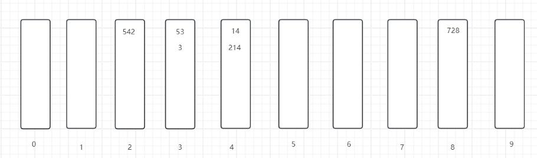

   按照个位数排序放进桶中后得到的顺序为 542， 53， 3， 14， 214， 728

4. 然后再依次**比较十位数**， 放到对应的桶中， 没有十位的前面补 0 

   

   按照十位数放入桶中得到的顺序为： 3,14， 214， 728， 542， 53  

5. 依次**比较百位数**， 放到对应的桶中去， 没有百位的补 0 
   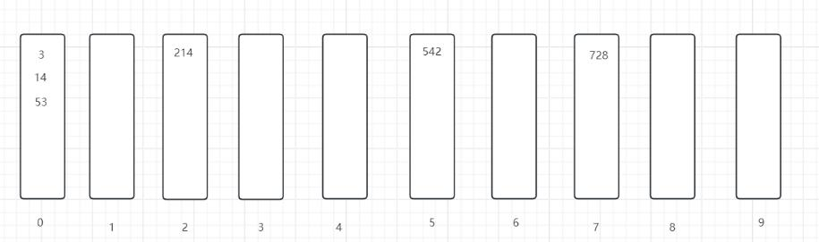
   按照百位数放入桶中的顺序是： {3, 14，53，214，542，728}

### 基数排序案例

#### 基数排序案例一


[基数排序代码](.\src\main\java\com\xi\sort排序算法\BasicSort.java)：  用集合写

```java
private static final int[] array = {53, 3, 542, 728, 14, 214};

/**
  * 基数排序算法
  * 用集合写
  * @param array
  * @return 排序后的值
  */
public static int[] sort(int[] array) {
    // 1. 找出最大值
    int max = 0;
    for (int temp : array) {
        if (temp > max) {
            max = temp;
        }
    }
    // 2. 计算最大值的位数
    int maxDigit = 0;// 位数
    while (max != 0) {
        max /= 10;// 除以10
        maxDigit++;
    }
    // 3. 创建0-9的桶 (创建一个集合，里面放10个桶，每个桶都是一个集合， 约定每个桶存放与该桶索引相同的指定位数值的待排序数据)
    ArrayList<ArrayList<Integer>> buckets = new ArrayList<ArrayList<Integer>>();
    for (int i = 0; i < 10; i++) {
        buckets.add(new ArrayList<Integer>());
    }
    // 4. 从个位数到最高位数进行"最高位数"次排序
    int moid = 10;// 定义取模数 从个位数开始取
    int div = 1;// 定义除数 从个位数开始取
    for (int i = 0; i < maxDigit; i++,moid*=10,div*=10) {// 控制一共取多少次位数进行排序, 每取一个值取模数和除数都*10
        // 4.1 取指定位数的值,将值放入指定的桶中
        for (int j = 0; j < array.length; j++) {// 对待排序的数据依次处理
            int num = array[j] % moid / div;// 取指定位数的值 eg: 42个位数的值：42%10/1=2, 42十位数的值：42%100/10=4
            buckets.get(num).add(array[j]);// 将值放入指定的桶中
        }
        // 4.2
        int index = 0;
        for (int j = 0; j < buckets.size(); j++) {// 对每个桶进行操作
            ArrayList<Integer> list = buckets.get(j);// 从0号(约定索引就是编号)桶开始获取对应桶内当前的值
            for (int k = 0; k < list.size(); k++) {// 对桶内每个数据排序
                array[index++] = list.get(k);// 将桶内的值放入原待排序数组中，实现该位数的排序
            }
            buckets.get(j).clear();// 清空已取出数据的桶，留给更高位排序时使用
        }
    }
    return array;
}
```

#### 基数排序案例二

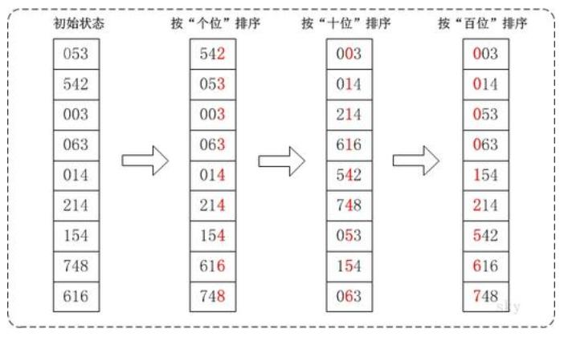

[基数排序代码](.\src\main\java\com\xi\sort排序算法\BasicSort.java)：  用二维数组写

```java
/**
  * 基数排序算法 案例二
  * 用二维数组写
  * @param array
  * @return
  */
public static int[] sort2(int[] array) {
    int max = 0;
    for (int i = 0; i < array.length; i++) {
        if (array[i] > max) {
            max = array[i];
        }
    }
    int maxDigit = (max + "").length();// 获取最大数的位数

    int[][] buckets = new int[10][array.length];// 二维数组 初始化十个桶
    int[] bucketsElementCount = new int[10];// 0-9号桶内的元素数

    int moid = 10;// 定义取模数 从个位数开始取
    int div = 1;// 定义除数 从个位数开始取
    // 从个位数到最高位数进行"最高位数"次排序
    for (int i = 0; i < maxDigit; i++,moid*=10,div*=10) {// 控制一共取多少次位数进行排序, 每取一个值取模数和除数都*10
        // 第一次比较 个位数
        for (int j = 0; j < array.length; j++) {
            int locationElement = array[j] % moid / div;// 个位数的值
            buckets[locationElement][bucketsElementCount[locationElement]] = array[j];// 将元素放入桶中 在这个桶的指定索引(索引为当前元素数)处放入该元素
            bucketsElementCount[locationElement]++;// 这个桶中的元素数+1
        }
        int index = 0;
        // 取出桶中元素
        for (int j = 0; j < buckets.length; j++) {// 对每个桶进行操作
            for (int k = 0; k < bucketsElementCount[j]; k++) {// 桶内有几个元素就取几次
                array[index++] = buckets[j][k];// 取出桶内元素
            }
            bucketsElementCount[j] = 0;// 取出后桶内元素为0
        }
    }
    return array;
}
```

## 三. 冒泡排序

### 冒泡排序介绍

#### 冒泡排序思想及演示

冒泡排序的思想是通过对待排序序列从前往后依次比较相邻元素值， 若发现逆序则交换， 使值较大的元素从前逐步移向后面， 就像水中气泡。

:arrow_down::arrow_down:点击页面上方`BUB`演示**冒泡排序**:arrow_down::arrow_down:

<iframe src="https://visualgo.net/zh/sorting" width="100%" height="800px" frameborder="0"></iframe>

#### 例子

假设待排序序列`[5,1,4,2,8]`， 如果采用冒泡排序对其进行升序(由小到大)排序， 则整个排序过程如下所示:

1. 第一轮排序， 此时整个序列中的元素都位于待排序序列， 依次扫描每对相邻的元素， 并对顺序不正确的元素对交换位置， 整个过程如图所示。

   

   从图可以看到， 经过第一轮冒泡排序， 从待排序序列中找出了最大数 8， 并将其放到了待排序序列的尾部， 并入已排序序列中。

2. 第二轮排序， 此时待排序序列只包含前 4 个元素， 依次扫描每对相邻元素， 对顺序不正确的元素对交换位置， 整个过程如图所示。

   

   经过第二轮冒泡排序， 从待排序序列中找出最大值 5， 将其放入待排序序列尾部

3. 第三轮排序， 此时待排序序列包含前 3 个元素， 依次扫描每对相邻元素， 对顺序不正确的元素对交换位置， 整个过程如图所示。

   

   经过第三轮排序， 找出最大值 4， 将其放入待排序序列中

4. 第四轮排序， 此时待排序序列包含前 2 个元素， 对其进行冒泡排序

   

   经过第三轮排序， 找出最大值 2， 将其放入待排序序列中
   第四轮排序， 此时待排序序列只有 1 个元素， 无需再进行相邻元素比较， 因此直接将其并入已排序序列中即可。

   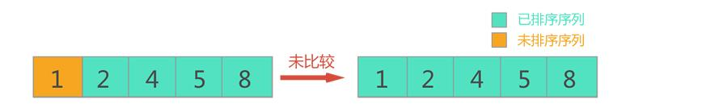


特点：

1. 需要循环 `array.length-1` 次外层循环
2. 每次排序的次数逐步递减
3. 也可能存在本次排序没有发生变化

### 冒泡排序案例

#### 冒泡排序案例一

[冒泡排序代码](.\src\main\java\com\xi\sort排序算法\BubblingSort.java)

冒泡排序：

```java
public static int[] sort(int[] array) {
    int temp = 0;// 第三方变量 用于冒泡时交换位置
    for (int i = 0; i < array.length-1; i++) {
        for (int j = 0; j < array.length-1-i; j++) {// 每次比较完了会少一个待排序序列
            if (array[j] > array[j+1]) {// 前面的比后面大，交换位置
                temp = array[j];
                array[j] = array[j+1];
                array[j+1] = temp;
            }
        }
    }
    return array;
}
```

#### 冒泡排序案例二

[冒泡排序代码](.\src\main\java\com\xi\sort排序算法\BubblingSort.java)

冒泡排序**优化**，如果上一轮都是有序的将不在进行后面轮次的比对：

```java
public static int[] sort(int[] array) {
    System.out.println("排序前：" + Arrays.toString(array));
    int temp = 0;// 第三方变量 用于冒泡时交换位置
    for (int i = 0; i < array.length-1; i++) {
        boolean flag = false;// 经过一轮排序是否交换过位置
        for (int j = 0; j < array.length-1-i; j++) {// 每次比较完了会少一个待排序序列
            if (array[j+1] < array[j]) {// 后面的小于前面的，交换位置
                temp = array[j];
                array[j] = array[j+1];
                array[j+1] = temp;
                flag = true;// 标记这一轮比对交换过位置
            }
        }
        System.out.println("第" + (i+1) + "轮排序结果：" + Arrays.toString(array));
        if (flag == false) {// 这一轮没有交换过位置，不再进行后面轮次的比对
            break;
        }
    }
    return array;
}
```

## 四. 快速排序

### 快速排序介绍

#### 思想

快速排序是对冒泡排序的一种改进。 通过一趟排序将要排序的数据分割成独立的两部分， 其中一部分的所有数据都比另一部分所有的数据都要小， 然后再按此方法对这两部分数据分别进行快速排序， 整个排序过程可以递归进行， 以此达到整个数据变成有序序列 。

:arrow_down::arrow_down:点击页面上方`QUI`演示**快速排序**:arrow_down::arrow_down:

<iframe src="https://visualgo.net/zh/sorting" width="100%" height="800px" frameborder="0"></iframe>

#### 例子

对以下数列按从小到大进行排序： 

1. 首先，选定基准元素p，并设置左右两个指针l和r
2. 开始循环后，从指针开始，**让指针元素与基准元素做比较**，如果**大于等于P,则r指针向左移动**；如果**小于p,则停止移动**，换到l指针。
3. 对于当前数列，r指针元素为1,1<4，所以指针停止移动，换到指针。
4. 换到指针后，让**l指针元素与基准元素做比较**，如果**小于等于p,则指针向右移动**；如果大于p，则停止移动。按照此思路，后续步骤如下：


### 快速排序案例

[快速排序代码](.\src\main\java\com\xi\sort排序算法\QuickSort.java)

```java
/**
 * @author ZC_Wu 汐
 * @date 2024/9/4 15:58:21
 * @description 快速排序 升序
 */
public class QuickSort {
    //测试数据
    private static final int[] array = {1, 4, 6, 3, 4, 2, 7, 5, 2}

    public static void main(String[] args) {
        quickSort(array, 0, array.length-1);
        System.out.println("排序后array = " + Arrays.toString(array));
    }

    public static void quickSort(int[] arr, int startIndex, int endIndex) {
        if (startIndex >= endIndex) {
            return;
        }
        int pIndex = partition(arr, startIndex, endIndex);// 得到基准元素排序后的位置
        quickSort(arr, startIndex, pIndex-1);
        quickSort(arr, pIndex+1,  endIndex);
    }

    /**
     * 快速排序得到基准元素完成排序后在数组中的位置 会由基准元素分割出两部分数据，左边是比基准元素小的，右边是比基准元素大的
     * @param arr 待排序数组
     * @param startIndex 左指针
     * @param endIndex 右指针
     * @return 返回基准元素的索引位置 这个索引位置就是基准元素排完序后的位置
     */
    public static int partition(int[] arr, int startIndex, int endIndex) {
        int p = arr[startIndex];// 基准元素
        System.out.print("基准元素p=" + p);
        int l = startIndex;// 左指针
        int r = endIndex;// 右指针

        while (l != r) {
            // 右指针执行 右指针元素与基准元素比较，满足右指针元素大于基准元素，右指针左移，直至右指针元素小于基准元素
            while (l < r && arr[r] > p) {
                r--;
            }
            // 左指针执行 左指针元素与基准元素比较，满足左指针元素小于基准元素，左指针右移，直至左指针元素大于基准元素
            while (l < r && arr[l] <= p) {
                l++;
            }
            if (l < r) {
                // 左右指针位置的数据交换位置
                int temp = arr[l];
                arr[l] = arr[r];
                arr[r] = temp;
            }
        }
        // 基准元素 和 l与r重合元素 交换位置， 交换位置后生成由基准元素分割的两部分数组
        arr[startIndex] = arr[l];
        arr[l] = p;
        // 返回基准元素的索引位置 这个索引位置就是基准元素排完序后的位置
        return l;
    }
}
```

eg: 升序排序[1, 4, 6, 3, 4, 2, 7, 5, 2]

| 次数  | startIndex | endIndex | 基准数据 | 基准数据<br />排序后索引 | 排序后数组                      |
| ----- | ---------- | -------- | -------- | ------------------------ | ------------------------------- |
| 1     | 0          | 8        | 1        | 0                        | [**1**, 4, 6, 3, 4, 2, 7, 5, 2] |
| 2     | 1          | 8        | 4        | 5                        | [1, **2**, 2, 3, 4, 4, 7, 5, 6] |
| 3     | 1          | 4        | 2        | 2                        | [1, 2, 2, **3**, 4, 4, 7, 5, 6] |
| 4     | <u>3</u>   | <u>8</u> | 3        | 3                        | [1, 2, 2, 3, 4, 4, **7**, 5, 6] |
| 5     | <u>4</u>   | <u>8</u> | 7        | 8                        | [1, 2, 2, 3, 4, 4, **6**, 5, 7] |
| 6     | 4          | 7        | 6        | 7                        | [1, 2, 2, 3, 4, 4, 5, 6, 7]     |
| ~~7~~ | ~~8~~      | ~~8~~    |          |                          |                                 |

## 五.  插入排序

### 插入排序介绍

插入排序属于内部排序， 是对于排序的元素以插入的方式寻找该元素的适当位置， 以达到排序的目的。  


:arrow_down::arrow_down:点击页面上方`INS`演示**插入排序**:arrow_down::arrow_down:

<iframe src="https://visualgo.net/zh/sorting" width="100%" height="800px" frameborder="0"></iframe>

### 插入排序案例

[插入排序代码](.\src\main\java\com\xi\sort排序算法\InsertSort.java)

```java
public static void insertSort(int[] array) {
    int temp;
    for (int i = 1; i < array.length; i++) {
        for (int j = i; j >= 1; j--) {
            if (array[j] < array[j-1]) {
                temp = array[j];
                array[j] = array[j-1];
                array[j-1] = temp;
            } else {
                break;
            }
        }
    }
}
```

## 六. 选择排序

### 选择排序介绍

第一次从待排序的数据元素中选出最小（或最大） 的一个元素， 存放在序列的起始位置，然后再从剩余的未排序元素中寻找到最小（大） 元素， 然后放到已排序的序列的末尾。 以此类推， 直到全部待排序的数据元素的个数为零。 选择排序是不稳定的排序方法。

:arrow_down::arrow_down:点击页面上方`SEI`演示**选择排序**:arrow_down::arrow_down:

<iframe src="https://visualgo.net/zh/sorting" width="100%" height="800px" frameborder="0"></iframe>

### 选择排序案例


[选择排序代码](.\src\main\java\com\xi\sort排序算法\SelectSort.java)

```java
public static void selectSort(int[] array) {
    for (int i = 0; i < array.length-1; i++) {
        int minIndex = i;// 遍历部分的最小值索引
        int min = array[minIndex];

        for (int j = i+1; j < array.length; j++) {// 找到遍历部分最小的值
            if (min > array[j]) {
                minIndex = j;
                min = array[minIndex];
            }
        }

        if (i != minIndex) {
            // 最小值和基准值交换位置
            array[minIndex] = array[i];
            array[i] = min;
        }
    }
}
```

## 七. 希尔排序

### 希尔排序介绍

希尔排序(Shell's Sort)是插入排序的一种又称“ 缩小增量排序” （ Diminishing Increment Sort） ， 是**排序算法的一种更高效的改进版本  **。但希尔排序是非稳定排序算法。

希尔排序是把记录按下标的一定**增量分组**， 对每组使用直接插入排序算法排序； 随着增量(分组个数)逐渐减少， 每组包含的元素越来越多， 当增量减至 1 时， 整个文件恰被分成一组， 算法便终止。

希尔排序是基于插入排序的以下两点性质而提出改进方法的：

插入排序在对几乎已经排好序的数据操作时，效率高，即可以达到线性排序的效率；
但插入排序一般来说是低效的，因为插入排序每次只能将数据移动一位；
希尔排序的基本思想是：先将整个待排序的记录序列分割成为若干子序列分别进行直接插入排序，待整个序列中的记录"基本有序"时，再对全体记录进行依次直接插入排序。   

希尔排序演示：


### 希尔排序案例

1. 初始增量第一趟`gap=length/2=4`
   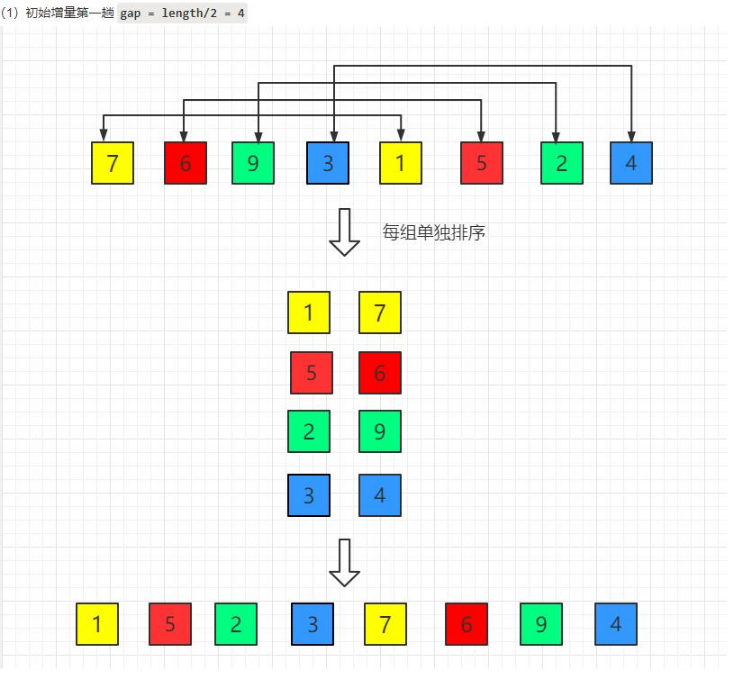
2. 第一趟`gap=length/2/2=2`
   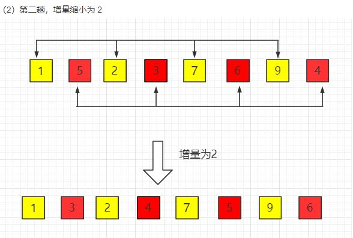
3. 第三趟`gap=length/2/2/2=1`
   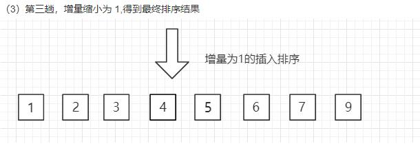

[希尔排序代码](.\src\main\java\com\xi\sort排序算法\ShellSort.java)

```java
public class ShellSort {
    //测试数据
    private static final int[] array = {1, 4, 6, 3, 4, 2, 7, 5, 2};

    public static void main(String[] args) {
        shellSort(array);
        System.out.println("排序后数组：" + Arrays.toString(array));
    }

    /**
     * 负责分组
     * @param array 待排序数组
     */
    public static void shellSort(int[] array) {
        System.out.println("待排序数据 = " + Arrays.toString(array) + "  数组长度：" + array.length);
        int gap = array.length;//  步长，也就是分组的数量

        while (gap > 1) {// 当length=1时无法再进行分组
            gap /= 2;
            shell(array, gap);// 插入排序
        }

    }

    /**
     * 负责分完组后对每组元素进行插入排序
     * @param array 待排序数组
     * @param gap 组的个数
     */
    public static void shell(int[] array, int gap) {
        if (array == null) {
            return;
        }

        int temp = 0;
        for (int i = gap; i < array.length; i++) {// 分好组
            temp = array[i];
            for (int j = i - gap; j >= 0; j -= gap) {// 组内元素进行排序
                if (array[j] > temp) {
                    array[j+gap] = array[j];
                    array[j] = temp;
                } else {
                    break;
                }
            }
        }
        System.out.println("一组排序后(分组数" + gap + ") = " + Arrays.toString(array));
    }
}
```

**shell方法解析：**

假设有待排序数组中九个元素

第一次分组(4组)
第1组0:4
第2组1:5
第3组2:6
第4组3:7
4:8

1. i=4, true, temp=array[4]
   j=4-4=0,true, array[0]:array[4]比对;
   j=0-4=-4, false, break;
2. i=5, true, temp=array[5]
   j=5-4=1,true , array[1]:array[5]比对;
   j=1-4=-3, false, break;
3. i=6, true, temp=array[6]
   j=6-4=2,true , array[2]:array[6]比对;
   j=2-4=-2, false, break;
4. i=7, true, temp=array[7]
   j=7-4=3,true , array[3]:array[7]比对;
   j=2-4=-2, false, break;
5. i=8, true, temp=array[8]
   j=8-4=4,true , array[4]:array[8]比对;
   j=4-4=0, true, array[0]:array[8]比对;
   j=0-4=-4, false, break;
6. i=9,false

第二次分组(2组)
第1组1:3 1:5 1:7
第2组0:2 2:4 0:4 4:6 2:6 0:6 6:8 4:8 2:8 0:8

1. i=2, true, temp=array[2]
   j=2-2=0,true , array[0]:array[2]比对;
   j=0-2=-2,false, break;
2. i=3, true, temp=array[3]
   j=3-2=1,true , array[1]:array[3]比对;
   j=1-2=-1, false, break;
3. i=4, true, temp=array[4]
   j=4-2=2,true , array[2]:array[4]比对;
   j=2-2=0,true , array[0]:array[4]比对;
   j=0-2=-2, false, break;
4. i=5, true, temp=array[5]
   j=5-2=3,true , array[3]:array[5]比对;
   j=3-2=1, true, array[1]:array[5]比对；
   j=1-2=-1, false, break;
5. i=6, true, temp=array[6]
   j=6-2=4,true , array[4]:array[6]比对;
   j=4-2=2, true, array[2]:array[6]比对；
   j=2-2=0, true, array[0]:array[6]比对；
   j=0-2=-2, false, break;
6. i=7, true, temp=array[7]
   j=7-2=5,true , array[5]:array[7]比对;
   j=5-2=3, true, array[3]:array[7]比对；
   j=3-2=1, true, array[1]:array[7]比对；
   j=1-2=-1, false, break;
7. i=8, true, temp=array[8]
   j=8-2=6,true , array[6]:array[8]比对;
   j=6-2=4, true, array[4]:array[8]比对；
   j=4-2=2, true, array[2]:array[8]比对；
   j=2-2=0, true, array[0]:array[8]比对；
   j=0-2=-2, false, break;
8. i=9, false

第三次分组(1组)
0:1 1:2 0:2 2:3 1:3 0:3 3:4 2:4 1:4 0:4 4:5 3:5 2:5 1:5 0:5...

1. i=1, true, temp=array[1]
   j=1-1=0,true,array[0]:array[1]比对;
   j=0-1=-1, false, break;
2. i=2, true, temp=array[2]
   j=2-1=1,true , array[1]:array[2]比对;
   j=1-1=0,true,array[0]:array[2]比对;
   j=0-1=-1, false, break;
3. i=3, true, temp=array[3]
   j=3-1=2,true , array[2]:array[3]比对;
   j=2-1=1,true , array[1]:array[3]比对;
   j=1-1=0,true,array[0]:array[3]比对;
   j=0-1=-1, false, break;
4. i=4, true, temp=array[4]
   j=4-1=3,true , array[3]:array[4]比对;
   j=3-1=2,true , array[2]:array[4]比对;
   j=2-1=1,true , array[1]:array[4]比对;
   j=1-1=0,true,array[0]:array[4]比对;
   j=0-1=-1, false, break;
5. ...
