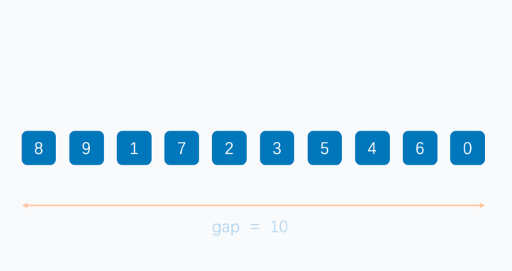

[java数据结构与算法——动力节点24课程传送门->b站](https://www.bilibili.com/video/BV1tU411U7SF?p=1&vd_source=796ed40051b301bfa3a84ba357f4828c)

# Ⅰ. 数据结构和算法概述

## 一. 数据结构和算法介绍

***算法*:**

算法是指解题方案的准确而完整的描述， 是一系列解决问题的清晰指令， 算法代表着用系统的方法描述解决问题的策略机制。 也就是说， 能够对一定规范的输入， 在有限时间内获得所要求的输出。 如果一个算法有缺陷， 或不适合于某个问题， 执行这个算法将不会解决这个问题。 不同的算法可能用不同的时间、 空间或效率来完成同样的任务。 一个算法的优劣可以用空间复杂度与时间复杂度来衡量。算法是独立存在的一种解决问题的方法和思想。对于算法而言， 实现的语言并不重要， 重要的是思想。

我们可以用不同的算法解决相同的问题， 而不同的算法的成本也是不相同的。 

总体上， **一个优秀的算法追求以下两个目标**:

1. 花最少的时间完成需求
2. 占用最少的内存空间完成需求

***数据结构*:**

数据结构就是把数据组织起来， 为了更方便地使用数据我们为了解决问题， 需要将数据保存下来， 然后根据数据的存储方式来设计算法实现进行处理， 那么数据的存储方式不同就会导致需要不同的算法进行处理。 我们希望算法解决问题的效率越快越好， 于是我们就需要考虑数据究竟如何保存的问题， 这就是数据结构。

数据结构是计算机存储、 组织数据的方式。 数据结构是指相互之间存在一种或多种特定关系的数据元素的集合。  

## 二. 数据结构分类

传统上， 我们可以把数据结构分为逻辑结构和物理结构两大类。 

### 1. 逻辑结构

逻辑结构是从具体问题中抽象出来的模型， 是抽象意义上的结构， 按照对象中数据元素之间的相互关系分类， 也是我们后面课题中需要关注和讨论的问题。

1. ***集合结构***:集合结构中数据元素除了属于同一个集合外， 他们之间没有任何其他的关系。
   
   
2. ***线性结构***:线性结构中的数据元素之间存在一对一的关系 
   
   
3. ***树形结构***:树形结构中的数据元素之间存在一对多的层次关系
   
   
4. ***图形结构***:图形结构的数据元素是多对多的关系
   
   

### 2. 物理结构

逻辑结构在计算机中真正的表示方式(又称为映像)称为物理结构， 也可以叫做存储结构。 常见的物理结构有顺序存储结构、 链式存储结构。

1. ***顺序存储结构***:把数据元素放到地址连续的存储单元里面， 其数据间的逻辑关系和物理关系是一致的， 比如我们常用的数组就是顺序存储结构。
   
   
   
   顺序存储结构存在一定的弊端,就像生活中排时也会有人插队也可能有人有特殊情况突然离开， 这时候整个结构都处于变化中， 此时就需要链式存储结构。
2. ***链式存储结构***:是把数据元素存放在任意的存储单元里面,这组存储单元可以是连续的也可以是不连续的。 此时， 数据元素之间并不能反映元素间的逻辑关系， 因此在链式存储结构中引进了一个指针存放数据元素的地址， 这样通过地址就可以找到相关联数据元素的位置
   
   

### 线性结构和非线性结构

***线性结构***

- 线性结构作为最常用的数据结构， 其特点是数据元素之间存在一对一的线性关系。
- 线性结构有两种不同的存储结构， 即顺序存储结构(数组)和链式存储结构(链表)。顺序存储的线性表称为顺序表， 顺序表中的存储元素是连续的。
- 链式存储的线性表称为链表， 链表中的存储元素不一定是连续的， 元素结点存放数据元素以及相邻元素的地址信息。
- 线性结构常见的有： 数组、 队列、 链表和栈


***非线性结构***

二维数组， 多维数组， 广义表， 树结构， 图结构。


# Ⅱ. 时间和空间复杂度  

## 一. 时间和空间复杂度分析

### 时间复杂度分析

我们要计算算法时间耗费情况， 首先我们得度量算法的执行时间：

***郭后分析估算方法*:**

比较容易想到的方法就是我们把算法执行若干次， 然后拿个计时器在旁边计时， 这种事后统计的方法看上去的确不错， 并且也并非要我们真的拿个计算器在旁边计算， 因为计算机都提供了计时的功能。 这种统计方法主要是通过设计好的测试程序和测试数据,利用计算机计时器对不同的算法编制的程序的运行时间进行比较， 从而确定算法效率的高低， 但是这种方法有很大的缺陷:必须依据算法实现编制好的测试程序， 通常要花费大量时间和精力， 测试完了如果发现测试的是非常糟糕的算法， 那么之前所做的事情就全部白费了,并且不同的测试环境(硬件环境)的差别导致测试的结果差异也很大。

***事前分析估算方法*:**

在计算机程序编写前， 依据统计方法对算法进行估算， 经过总结， 我们发现**一个高级语言编写的程序程序在计算机上运行所消耗的时间取决于下列因素**:

1. 算法采用的策略和方案
2. 编译产生的代码质量
3. 问题的输入规模(所谓的问题输入规模就是输入量的多少)
4. 机器执行指令的速度

***分析：***

由此可见， 抛开这些与计算机硬件、 软件有关的因素， 一个程序的运行时间依赖于算法的好坏和问题的输入规模。 如果算法固定， 那么该算法的执行时间就只和问题的输入规模有关系了。我们再次以之前的求和案例为例， 进行分析。

**需求**:计算 1 到 100 的和。

**解法:**


上面这个例子中， 如果我们要精确的研究循环的条件执行了多少次， 是一件很麻烦的事情， 并且， 由于真正计算和代码内循环的循环体， 所以， 在**研究算法的效率时**， 我们**只考虑核心代码的执行次数**， 这样可以简化分析。我们研究算法复杂度， **侧重的是当输入规模不断增大时， 算法的增长量的一个抽象(规律)**， 而不是精确地定位需要执行多少次， 因为如果是这样的话， 我们又得考虑回编译期优化等问题，容易主次跌倒。  

我们不关心编写程序所用的语言是什么， 也不关心这些程序将跑在什么样的计算机上， 我们只关心它所实现的算法。 这样， 不计那些循环索引的递增和循环终止的条件、 变量声明、 打印结果等操作， 最终在分析程序的运行时间时， 最重要的是把程序看做是独立于程序设计语言的算法或一系列步骤。 **我们分析一个算法的运行时间， 最重要的就是把核心操作的次数和输入规模关联起来**。  

---

***函数渐近增长概念***:
给定两个函数 $f(n)$和 $g(n)$,如果存在一个整数 $N$， 使得对于所有的 $n>N$,$f(n)$总是比 $g(n)$大， 那么我们说 $f(n)$的增长渐近快于 $g(n)$。 概念似乎有点艰涩难懂， 那接下来我们做几个测试。


### 时间复杂度测试一

**随着输入规模的增大， 算法的常数操作可以忽略不计**

假设四个算法的输入规模都是 n:

1. 算法 A1 要做 $2n+3$ 次操作,可以这么理解:先执行 $n $次循环,执行完毕后， 再有一个 $n $次循环，最后有 $3$ 次运算
2. 算法 A2 要做 $2n $次操作
3. 算法 B1 要做 $3n+1$ 次操作,可以这个理解:先执行 $n $次循环， 再执行一个 $n$ 次循环， 再执行一个 n 次循环， 最后有 1 次运算。
4. 算法 B2 要做 $3n$ 次操作;  

那么， 上述算法， 哪一个更快一些呢?  

| 输入规模 | 算法A1($2n+3$)执行次数 | 算法A2($2n$)执行次数 | 算法B1($3n+1$)执行次数 | 算法B2($3n$)执行次数 |
| -------- | ---------------------- | -------------------- | ---------------------- | -------------------- |
| n=1      | 5                      | 2                    | 4                      | 3                    |
| n=2      | 7                      | 4                    | 7                      | 6                    |
| n=3      | 9                      | 6                    | 10                     | 9                    |
| n=10     | 23                     | 20                   | 31                     | 30                   |
| n=100    | 203                    | 200                  | 301                    | 300                  |


通过数据表格， 比较算法 A1 和算法 B1:

- 当输入规模 $ n=1 $时， A1 需要执行 5 次， B1 需要执行 4 次， 所以 A1 的效率比 B1 的效率低
- 当输入规模 $n=2 $时， A1 需要执行 7 次， B1 需要执行 7 次， 所以 A1 的效率和 B1 的效率一样
- 当输入规模 $n>2$ 时， A1 需要的执行次数一直比 B1 需要执行的次数少， 所以 A1 的效率比 B1的效率高

**所以我们可以得出结论**:
当输入规模 n>2 时， 算法 A1 的渐近增长小于算法 B1 的渐近增长
通过观察折线图， 我们发现,随着输入规模的增大,算法 A1 和算法 A2 逐渐重叠到一块,算法 B1和算法 B2 逐渐重叠到一块， 所以我们得出结论:**随着输入规模的增大， 算法的常数操作可以忽略不计**

### 时间复杂度测试二

**随着输入规模的增大,与最高次项相乘的常数可以忽略**

假设四个算法的输入规模都是n:

1. 算法C1需要做$4n+8$次操作
2. 算法C2需要做$n$次操作
3. 算法D1需要做$2n^2$次操作
4. 算法D2需要做$n^2$次操作

那么上述算法，哪个更快一些？

| 输入规模 | 算法C1($4n+8$)执行次数 | 算法C2($n$)执行次数 | 算法D1($2n^2$)执行次数 | 算法D2($n^2$)执行次数 |
| -------- | ---------------------- | ------------------- | ---------------------- | --------------------- |
| n=1      | 12                     | 1                   | 3                      | 1                     |
| n=2      | 16                     | 2                   | 9                      | 4                     |
| n=3      | 20                     | 3                   | 19                     | 9                     |
| n=10     | 48                     | 10                  | 201                    | 100                   |
| n=100    | 408                    | 100                 | 20001                  | 10000                 |
| n=1000   | 4008                   | 1000                | 2000001                | 1000000               |


通过数据表格， 对比算法 C1 和算法 D1:

- 当输入规横 $n\leqslant3 $时， 算法 C1 执行次数多于算法 D1， 因此算法 C1 效率低一些
- 当输入规模 $n>3 $时， 算法 C1 执行次数少于算法 D1， 因此算法 D2 效率低一些，

所以， 总体上,算法 C1 要优于算法 D1

通过折线图， 对比对比算法 C1 和 C2:
随着输入规模的增大， 算法 C1 和算法 C2 几乎重叠

通过折线图， 对比算法 C 系列和算法 D 系列:
随着输入规模的增大， 即使去除 n^2 前面的常数因子， D 系列的次数要远远高于 C 系列。

因此， 可以得出结论:**随着输入规模的增大,与最高次项相乘的常数可以忽略**

### 时间复杂度测试三

**最高次项的指数大的， 随着 n 的增长， 结果也会变得增长特别快**

假设四个算法的输入规模都是 n:

- 算法 E1:$2n^2+3n+1$;
- 算法 E2:$n^2$
- 算法 F1:$2n^3+3n+1$
- 算法 F2:$n^3$

那么上述算法， 哪个更快一些?

| 输入规模 | 算法E1($2n^2+3n+1$)执行次数 | 算法E2($n^2$)执行次数 | 算法F1($2n^3+3n+1$)执行次数 | 算法F2($n^3$)执行次数 |
| -------- | --------------------------- | --------------------- | --------------------------- | --------------------- |
| n=1      | 6                           | 1                     | 6                           | 1                     |
| n=2      | 15                          | 4                     | 23                          | 8                     |
| n=3      | 28                          | 9                     | 64                          | 27                    |
| n=10     | 231                         | 100                   | 2031                        | 1000                  |
| n=100    | 20301                       | 10000                 | 2000301                     | 1000000               |


通过数据表格、 对比算法 E1 和算法 F1:

- 当 $n=1$ 町、 算法 1 和算法 F1 的执行次数一样
- 当 $n>1$ 时， 算法 E1 的执行次数远远小于算法 F1 的执行次数

所以算法 E1 总体上是由于算法 F1 的。

通过折线图我们会看到， 算法 F 系列随着 n 的增长会变得特块， 算法 E 系列随着 n 的增长相比较算法 F 来说， 变得比较慢，
所以可以得出结论:**最高次项的指数大的， 随着 n 的增长， 结果也会变得增长特别快**

### 时间复杂度测试四

**算法函数中 n 最高次幂越小， 算法效率越高**

假设五个算法的输入规模都是 n:

- 算法 G:$n^3$
- 算法 H:$n^2$
- 算法 I: $n$
- 算法J: $\log n$
- 算法 K: $1$

那么上述算法， 哪个效率更高呢?

| 输入规模 | 算法 G($n^3$)执行次数 | 算法H($n^2$)执行次数 | 算法I($n$)执行次数 | 算法J( $\log n$)执行次数 | 算法 K($1$) |
| -------- | --------------------- | -------------------- | ------------------ | ------------------------ | ----------- |
| n=2      | 8                     | 4                    | 2                  | 1                        | 1           |
| n=4      | 64                    | 16                   | 4                  | 2                        | 1           |


通过观察数据表格和折线图。 很容易可以得出结论的:**算法函数中 n 最高次幂越小， 算法效率越高**

### 时间复杂度规则总结

综上所述， 在我们比较算法随着输入规模的增长量时， 可以有以下规则: 

1. **算法函数中的常数可以忽略**
2. **算法函数中最高次幂的常数因子可以忽略**
3. **算法函数中最高次幂越小， 算法效率越高。**

## 二. 时间频度

***时间频度***： 一个算法花费的时间与算法中语句的执行次数成正比， 哪一个算法中语句执行次数多， 那么他所花费的时间就会多。 **一个算法中语句执行次数称之为语句频度或时间频度**。 记为 $T(n)  $

- **忽略常数项**
- **忽略低次项**
- **忽略系数**  

## 三. 算法时间复杂度

### 1. 大O记法

用大写 $O()$来体现算法时间复杂度的记法， 我们称之为**大 O 记法**。 

一般情况下， 随着输入规模$n $的增大， $T(n)$增长最慢的算法为最优算法。下面我们使用大 O 表示法来表示一些求和算法的时间复杂度:

如果忽略判断条件的执行次数和输出语句的执行次数， 那么当输入规模为 $n $时， 各算法执行的次数分别为:

- 算法一:$3 $次
- 算法二:$n+3 $次
- 算法三:$n^2+2 $次

如果用大 O 记法表示上述每个算法的时间复杂度， 应该如何表示呢?基于我们对函数渐近增长的分析， 推导==大 O 阶的表示法有以下几个**规则**==可以使用:

1. **用常数 1 取代运行时间中的所有加法常数**
2. **在修改后的运行次数中， 只保留高阶项**
3. **如果最高阶项存在， 且常数因子不为 1， 则去除与这个项相乘的常数**

所以， 上述算法的**大 O 记法分别为**:

- 算法一:$O(1)$
- 算法二:$O(n)$
- 算法三:$ O(n^2)$

### 2. 常见的大O阶

1. ***线性阶***：
   一般含有非嵌套循环涉及线性阶， 线性阶就是随着输入规模的扩大， 对应计算次数呈直线增长

   ```java
   int sum = 0;
   int n = 100;
   for (int i = 0; i <= n; i++) {
       sum += i;
   }
   System.out.println("sum=" + sum);
   ```

   上面这段代码， 它的循环的时间复杂度为 $O(n)$,因为循环体中的代码需要执行$ n $次  

2. 平方阶
   一般嵌套循环属于这种时间复杂度

   ```java
   int sum = 0, n = 100;
   for (int i = 1; i <= n; i++) {
       for (int j = 1; j <= n; j++) {
           sum+=i;
       }
   }
   System.out.println("sum=" + sum);
   ```

   上面这段代码， $n=100$， 也就是说， 外层循环每执行一次， 内层循环就执行 100 次， 那总共程序想要从这两个循环中出来， 就需要执行 $100\times100 $次， 也就是 $n$ 的平方次， 所以这段代码的时间复杂度是 $O(n^2)  $

3. 立方阶
   一般三层嵌套循环属于这种时间复杂度

   ```java
   int x = 0, n = 100;
   for (int i = 1; i <= n; i++) {
       for (int j = i; j <= n; j++) {
           for (j = i; j <= n ; j++) {
               x++;
           }
       }
   }
   System.out.println(x);
   ```

   上面这段代码， $n=100$， 也就是说， 外层循环每执行一次， 中间循环循环就执行 100 次， 中间循环每执行一次， 最内层循环需要执行 100 次， 那总共程序想要从这三个循环中出来， 就需要执行 100100100 次， 也就是 n 的立方， 所以这段代码的时间复杂度是 $O(n^3)  $

4. 对数阶

   ```java
   int i = 1, n = 100;
   while (i < n) {
       i = i * 2;
   }
   ```

   由于每次 $i\times2 $之后， 就距离 n 更近一步， 假设有 x 个 2 相乘后大于 n,则会退出循环。由于是 $2^x=n$,得到$ x=\log_2n$,所以这个循环的时间复杂度为 $O(\log n)$;
   **对于对数阶**， 由于随着输入规模 n 的增大， 不管底数为多少， 他们的增长趋势是一样的， 所以我们**会忽略底数**。

   

5. 常数阶

   ```java
   int n = 100;
   int i = n + 2;
   System.out.println(i);
   ```

   一般不涉及循环操作的都是常数阶、 因为它不会随着 n 的増长而増加操作次数。
   上述代码， 不管输入规模 n 是多少， 都执行 2 次， 根据大 0 推导法则， **常数用 1 来替换**， 所以上述代码的时间复杂度为 $O(1)$

==下面是对常见时间复杂度的一个总结:==

| 描述         | 增长的数量级 | 说明     | 举例           |
| :----------- | :----------- | :------- | :------------- |
| 常数级别     | $1$          | 普通语句 | 两数相加       |
| 对数级别     | $\log n$     | 二分策略 | 二分查找       |
| 线性级别     | $n$          | 循环     | 找最大元素     |
| 线性对数级别 | $n\log n$    | 分治思想 | 归并排序       |
| 平方级别     | $n^2$        | 双层循环 | 检查所有元素对 |
| 立方级别     | $n^3$        | 三层循环 | 检查所有二元组 |
| 指数级别     | $2^n$        | 穷举查找 | 检查所有子集   |

他们的**复杂程度从低到高依次为: $O(1)<O(\log n)<O(n)<O(n\log n)<O(n^2)<O(n^3)$**

根据前面的折线图分析， 我们会发现， 从平方阶开始， 随着输入规模的增大， 时间成本会急剧增大， 所以， 我们的算法,尽可能的追求的是 $O(1),O(logn),O(n),O(nlogn)$这几种时间复杂度， 而如果发现算法的时间复杂度为平方阶、 立方阶或者更复杂的， 那我们可以分为这种算法是不可取的， 需要优化。

## 四. 函数调用的时间复杂度分析

**案例一：**

```java
public static void main(String[] args) {
    int n = 100;
    for (int i = 0; i < n; i++) {
        show(i);
    }
}
private static void show(int i) {
    System.out.println(i);
}
```

在 main 方法中， 有一个 for 循环， 循环体调用了 show 方法， 由于 show 方法内部只执行了一行代码， 所以 show 方法的时间复杂度为 $O(1)$,那 main 方法的时间复杂度就是 $O(n)  $

**案例二：**

```java
public static void main(String[] args) {
    int n = 100;
    for (int i = 0; i < n; i++) {
        show(i);
    }
}
private static void show(int i) {
    for (int j = 0; j < i; j++) {
        System.out.println(i);
    }
}
```

在 main 方法中， 有一个 for 循环， 循环体调用了 show 方法， 由于 show 方法内部也有一个 for循环， 所以 show 方法的时间复杂度为 $O(n)$,那 main 方法的时间复杂度为 $O(n^2)  $

**案例三：**

```java
public static void main(String[] args) {
    int n = 100;
    for (int i = 0; i < n; i++) {
        show(i);
    }
    for (int i = 0; i < n; i++) {
        for (int j = 0; j < n; j++) {
            System.out.println(j);
        }
    }
}
private static void show(int i) {
    for (int j = 0; j < i; j++) {
        System.out.println(i);
    }
}
```

在 show 方法中， 有一个 for 循环， 所以 show 方法的时间复杂度为 O(n),在 main 方法中， show(n)这行代码内部执行次数为 $n$， 第一个 for 循环内调用了 show 方法， 所以其执行次数为$ n^2$,第二个嵌套 for 循环内只执行了一行代码， 所以其执行次数为 $n^2$,那么 main 方法总执行次数为$n+n^2+n^2=2n^2+n$。 根据大 0 推导规则， 去掉$ n $保留最高阶项,并去掉最高阶项的常数因子 $2$，所以最终 main 方法的时间复杂度为 $O(n^2)  $

## 五. 平均和最坏时间复杂度

***平均时间复杂度***: 是指所有可能的输入实例均以等概率的出现情况下得到算法的运行时间

***最坏时间复杂度***: 一般讨论的时间复杂度均是最坏情况下的时间复杂度， 这样做的原因是最坏情况下的时间复杂度是算法在任何输入实例上运行的界限， 这就保证了算法的运行时间不会比最坏情况更长。

平均时间复杂度和最坏时间复杂度是否一样， 这就需要根据算法不同而不同了

| 排序算法     | 平均时间复杂度 | 最坏时间复杂度 | 空间复杂度  | 是否稳定 |
| ------------ | -------------- | -------------- | ----------- | -------- |
| 冒泡排序     | $O(n^2)$       | $O(n^2)$       | $O(1)$      | 是       |
| 选择排序     | $O(n^2)$       | $O(n^2)$       | $O(1)$      | 不是     |
| 直接插入排序 | $O(n^2)$       | $O(n^2)$       | $O(1)$      | 是       |
| 归并排序     | $O(n\log n)$   | $O(n\log n)$   | $O(n)$      | 是       |
| 快速排序     | $O(n\log n)$   | $O(n^2)$       | $O(\log n)$ | 不是     |
| 堆排序       | $O(n\log n)$   | $O(n\log n)$   | $O(1)$      | 不是     |
| 希尔排序     | $O(n\log n)$   | $O(n^2)$       | $O(1)$      | 不是     |
| 计数排序     | $O(n+k)$       | $O(n+k)$       | $O(n+k)$    | 是       |
| 基数排序     | $O(n\times m)$ | $O(n\times m)$ | $O(m)$      | 是       |

从心理学角度讲， 每个人对发生的事情都会有一个预期， 比如看到手机剩余 50%电量， 有人会说:哇哦， 还有一半的电量哦!但也有人会说:天哪， 只有一半电量了。 一般人处于一种对未来失败的担忧， 而在预期的时候趋向做最坏的打算,这样即使最糟糕的结果出现， 当事人也有了心理准备， 比较容易接受结果。 假如最糟糕的结果井没有出现， 当事人会很快乐。

eg:

```java
public int search(int num) {
    int[] arr={11, 10, 9, 6, 22, 23, 44};
    for (int i = 0; i < arr.length; i++) {
        if (num == arr[i]) {
            return i;
        }
    }
    return -1;
}
```

- 最好情况:
  查找的第一个数字就是期望的数字， 那么算法的时间复杂度为 $O(1)$
- 最坏情况;
  查找的最后一个数字,才是期望的数字， 那么算法的时间复杂度为$ O(n)$
- 平均情况:
  任何数字查找的平均成本是 $O(n/2)$

最坏情况是一种保证， 在应用中， 这是一种最基本的保障， 即使在最坏情况下， 也能够正常提供服务， 所以， 除非特别指定， 我们提到的运行时间都指的是最坏情况下的运行时间。

## 六. 算法的空间复杂度分析

1. **基本数据类型内存占用情况**：
   | 数据类型 | 内存占用字节数 |
   | -------- | -------------- |
   | byte     | 1              |
   | short    | 2              |
   | int      | 4              |
   | long     | 8              |
   | float    | 4              |
   | double   | 8              |
   | bollean  | 1              |
   | char     | 2              |

2. **计算机访问内存的方式都是一次一个字节**  
   

3. 一**个引(机器地址)需要 8 个字节表示**
   例如` Date date - new Date()`,Date 这个变量要占用 8 个字节来表示

4. 创建一个对象， 比如 `new Date()`， 除了 **Date 对象内部存储的数据**(例如年月日等信息)占用的内存， 该**对象本身也有内存开销， 每个对象的自身开销是 16 个字节**， 用来保存对象的头信息。

5. 一般内存的使用， **如果不够 8 个字节， 都会被自动填充为 8 字节**
   ```java
   public class A {// 对象本身占用16个字节
       public int a = 1;// 成员变量int类型a占用4个字节
   }
   ```

   通过`new A()`创建一个对象总共需要20个字节，但由于不是以8位单位，会自动填充位24个字节

6. java 中**数组被被限定为对象**， 他们一般都会因为记录长度而需要额外的内存， **一个原始数据类型的数组一般需要 24 字节的头信息(16 个自己的对象开销， 4 字节用于保存长度以及 4 个填充字节)再加上保存值所需的内存**。

## 七. 算法的空间复杂度

了解了java的内存最基本的机制，就能够有效帮助我们估计大量程序的内存使用情况。

算法的**空间复杂度计算公式**记作：$S(n)=O(f(n)$,其中n为输入规模，f(n)为语句关于n所占存储空间的函数。

案例：对指定的数组元素进行反转，并返回反转的内容。

解法一：

```java
public static int[] reversel(int[]arr){
    int n = arr.length;//申请4个字节 
    int temp;//申请4个字节 
        for(int start=0, end=n-1; start<=end; start++, end--){ 
            temp=arr[start]; 
            arr[start]=arr[end]; 
            arr[end]=temp;
        }
    return arr;
}
```

解法二： 

```java
public static int[] reverse2(int[]arr){ 
    int n=arr.length;//申请4个字节
    int[]temp=new int[n];//申请n*4个字节+数组自身头信息开销24个字节 
    for (int i n-1;i >=0;i--){
        temp[n-1-i]=arr[i]; 
    } 
    return temp; 
}
```

忽略判断条件占用的内存，我们得出的内存占用情况如下：

- 算法一：不管传入的数组大小为多少，始终额外申请$4+4=8$个字节
- 算法二： $4+4n+24=4n+28$

根据大O推导法则，算法一的空间复杂度为$O(1)$,算法二的空间复杂度为$O(n)$,所以从空间占用的角度讲，算法一要优于算法二。由于java中有内存垃圾回收机制，并且jvm对程序的内存占用也有优化（例如即时编译)，我们无法精确的评估一个java程序的内存占用情况，但是了解了java的基本内存占用，使我们可以对java程序的内存占用情况进行估算。

由于现在的计算机设备内存一般都比较大，基本上个人计算机都是4G起步，大的可以达到32G,所以内存占用一般情况下并不是我们算法的瓶颈，**普通情况下直接说复杂度，默认为算法的时间复杂度**。

但是，如果你做的程序是嵌入式开发，尤其是一些传感器设备上的内置程序，由于这些设备的内存很小，一般为几kb，这个时候对算法的空间复杂度就有要求了，但是一般做java开发的，基本上都是服务器开发，一般不存在这样的问题。

# Ⅲ. 排序算法

## 一. 排序算法介绍

排序也称之为排序算法（Sort Algorithm） ，是讲一组数据以指定的顺序进行排列的过程。Java 提供了一个接口 `Comparable `就是用来定义排序规则的， 在这里我们以案例的形式对Comparable 接口做一个简单的回顾。

[代码](.\src\main\java\com\xi\Demo)

```java
@Getter
@Setter
@AllArgsConstructor
@NoArgsConstructor
public class Student implements Comparable<Student> {
    private Integer stuId;
    private String stuName;
    private Integer stuAge;

    /**
     * @param stu the object to be compared.
     * @return int
     * 年龄比较
     * 返回值三种情况
     *  >0当前对象大于传过来的对象
     *  =0当前对象等于传过来的对象
     *  <0当前对象小于传过来的对象
     */
    @Override
    public int compareTo(Student stu) {
        return this.stuAge-stu.stuAge;
    }
    @Override
    public String toString() {
        return "Student{" +
                "stuId=" + stuId +
                ", stuName=" + stuName +
                ", stuAge=" + stuAge +
                '}';
    }
}
```

```java
public class TestApp {
    public static void main(String[] args) {
        Student student1 = new Student(1, "小红", 19);
        Student student2 = new Student(2, "小明", 18);

        System.out.println("年龄大的是：" + getMax(student1, student2));
    }

    public static String getMax(Student stu1, Student stu2) {
        if (stu1.compareTo(stu2) > 0) {
            return stu1.getStuName();
        } else  if (stu1.compareTo(stu2) < 0) {
            return stu2.getStuName();
        } else if (stu1.compareTo(stu2) == 0) {
            return stu1.getStuName() + "和" + stu2.getStuName() + "一样大";
        } else {
            return null;
        }
    }
}
```

## 二. 基数排序|桶子法

### 基数排序介绍

#### 基数排序思想及演示

基数排序（radix sort） 属于“分配式排序” （distribution sort） ， 又称“桶子法”思想是将整数按位数切割成不同的数字， 然后按每个位数分别比较。

将所有的待比较数值统一设置为同样的数位长度， **位数比较短的数前面补零**， **然后从最低位开始依次进行一次排序**， 这样从最低位排序一直到最高位排序完成以后， 数列就变成一个有序序列

:arrow_down::arrow_down:点击页面上方`RAD`演示**基数排序**:arrow_down::arrow_down:

<iframe src="https://visualgo.net/zh/sorting" width="100%" height="800px" frameborder="0"></iframe>

#### 基数排序例子

例如：  

`int[] array = {53,3,542,728,14,214};  `

1. 首先**确定最大数**是 728（这个一定要确定） 

2. 确定位数后， 不足十位和百位的在**前面补0** 

3. **比较数组中的个位数**， 按照顺序放到对应的桶中， 每个桶都是一个一维数组， 全部放进去后， 再取出来重新排序。
   

   按照个位数排序放进桶中后得到的顺序为 542， 53， 3， 14， 214， 728

4. 然后再依次**比较十位数**， 放到对应的桶中， 没有十位的前面补 0 

   

   按照十位数放入桶中得到的顺序为： 3,14， 214， 728， 542， 53  

5. 依次**比较百位数**， 放到对应的桶中去， 没有百位的补 0 
   
   按照百位数放入桶中的顺序是： {3, 14，53，214，542，728}

### 基数排序案例

#### 基数排序案例一


[基数排序代码](.\src\main\java\com\xi\sort排序算法\BasicSort.java)：  用集合写

```java
private static final int[] array = {53, 3, 542, 728, 14, 214};

/**
  * 基数排序算法
  * 用集合写
  * @param array
  * @return 排序后的值
  */
public static int[] sort(int[] array) {
    // 1. 找出最大值
    int max = 0;
    for (int temp : array) {
        if (temp > max) {
            max = temp;
        }
    }
    // 2. 计算最大值的位数
    int maxDigit = 0;// 位数
    while (max != 0) {
        max /= 10;// 除以10
        maxDigit++;
    }
    // 3. 创建0-9的桶 (创建一个集合，里面放10个桶，每个桶都是一个集合， 约定每个桶存放与该桶索引相同的指定位数值的待排序数据)
    ArrayList<ArrayList<Integer>> buckets = new ArrayList<ArrayList<Integer>>();
    for (int i = 0; i < 10; i++) {
        buckets.add(new ArrayList<Integer>());
    }
    // 4. 从个位数到最高位数进行"最高位数"次排序
    int moid = 10;// 定义取模数 从个位数开始取
    int div = 1;// 定义除数 从个位数开始取
    for (int i = 0; i < maxDigit; i++,moid*=10,div*=10) {// 控制一共取多少次位数进行排序, 每取一个值取模数和除数都*10
        // 4.1 取指定位数的值,将值放入指定的桶中
        for (int j = 0; j < array.length; j++) {// 对待排序的数据依次处理
            int num = array[j] % moid / div;// 取指定位数的值 eg: 42个位数的值：42%10/1=2, 42十位数的值：42%100/10=4
            buckets.get(num).add(array[j]);// 将值放入指定的桶中
        }
        // 4.2
        int index = 0;
        for (int j = 0; j < buckets.size(); j++) {// 对每个桶进行操作
            ArrayList<Integer> list = buckets.get(j);// 从0号(约定索引就是编号)桶开始获取对应桶内当前的值
            for (int k = 0; k < list.size(); k++) {// 对桶内每个数据排序
                array[index++] = list.get(k);// 将桶内的值放入原待排序数组中，实现该位数的排序
            }
            buckets.get(j).clear();// 清空已取出数据的桶，留给更高位排序时使用
        }
    }
    return array;
}
```

#### 基数排序案例二


[基数排序代码](.\src\main\java\com\xi\sort排序算法\BasicSort.java)：  用二维数组写

```java
/**
  * 基数排序算法 案例二
  * 用二维数组写
  * @param array
  * @return
  */
public static int[] sort2(int[] array) {
    int max = 0;
    for (int i = 0; i < array.length; i++) {
        if (array[i] > max) {
            max = array[i];
        }
    }
    int maxDigit = (max + "").length();// 获取最大数的位数

    int[][] buckets = new int[10][array.length];// 二维数组 初始化十个桶
    int[] bucketsElementCount = new int[10];// 0-9号桶内的元素数

    int moid = 10;// 定义取模数 从个位数开始取
    int div = 1;// 定义除数 从个位数开始取
    // 从个位数到最高位数进行"最高位数"次排序
    for (int i = 0; i < maxDigit; i++,moid*=10,div*=10) {// 控制一共取多少次位数进行排序, 每取一个值取模数和除数都*10
        // 第一次比较 个位数
        for (int j = 0; j < array.length; j++) {
            int locationElement = array[j] % moid / div;// 个位数的值
            buckets[locationElement][bucketsElementCount[locationElement]] = array[j];// 将元素放入桶中 在这个桶的指定索引(索引为当前元素数)处放入该元素
            bucketsElementCount[locationElement]++;// 这个桶中的元素数+1
        }
        int index = 0;
        // 取出桶中元素
        for (int j = 0; j < buckets.length; j++) {// 对每个桶进行操作
            for (int k = 0; k < bucketsElementCount[j]; k++) {// 桶内有几个元素就取几次
                array[index++] = buckets[j][k];// 取出桶内元素
            }
            bucketsElementCount[j] = 0;// 取出后桶内元素为0
        }
    }
    return array;
}
```

## 三. 冒泡排序

### 冒泡排序介绍

#### 冒泡排序思想及演示

冒泡排序的思想是通过对待排序序列从前往后依次比较相邻元素值， 若发现逆序则交换， 使值较大的元素从前逐步移向后面， 就像水中气泡。

:arrow_down::arrow_down:点击页面上方`BUB`演示**冒泡排序**:arrow_down::arrow_down:

<iframe src="https://visualgo.net/zh/sorting" width="100%" height="800px" frameborder="0"></iframe>

#### 冒泡排序例子

假设待排序序列`[5,1,4,2,8]`， 如果采用冒泡排序对其进行升序(由小到大)排序， 则整个排序过程如下所示:

1. 第一轮排序， 此时整个序列中的元素都位于待排序序列， 依次扫描每对相邻的元素， 并对顺序不正确的元素对交换位置， 整个过程如图所示。

   

   从图可以看到， 经过第一轮冒泡排序， 从待排序序列中找出了最大数 8， 并将其放到了待排序序列的尾部， 并入已排序序列中。

2. 第二轮排序， 此时待排序序列只包含前 4 个元素， 依次扫描每对相邻元素， 对顺序不正确的元素对交换位置， 整个过程如图所示。

   

   经过第二轮冒泡排序， 从待排序序列中找出最大值 5， 将其放入待排序序列尾部

3. 第三轮排序， 此时待排序序列包含前 3 个元素， 依次扫描每对相邻元素， 对顺序不正确的元素对交换位置， 整个过程如图所示。

   

   经过第三轮排序， 找出最大值 4， 将其放入待排序序列中

4. 第四轮排序， 此时待排序序列包含前 2 个元素， 对其进行冒泡排序

   

   经过第三轮排序， 找出最大值 2， 将其放入待排序序列中
   第四轮排序， 此时待排序序列只有 1 个元素， 无需再进行相邻元素比较， 因此直接将其并入已排序序列中即可。

   


特点：

1. 需要循环 `array.length-1` 次外层循环
2. 每次排序的次数逐步递减
3. 也可能存在本次排序没有发生变化

### 冒泡排序案例

#### 冒泡排序案例一

[冒泡排序代码](.\src\main\java\com\xi\sort排序算法\BubblingSort.java)

冒泡排序：

```java
public static int[] sort(int[] array) {
    int temp = 0;// 第三方变量 用于冒泡时交换位置
    for (int i = 0; i < array.length-1; i++) {
        for (int j = 0; j < array.length-1-i; j++) {// 每次比较完了会少一个待排序序列
            if (array[j] > array[j+1]) {// 前面的比后面大，交换位置
                temp = array[j];
                array[j] = array[j+1];
                array[j+1] = temp;
            }
        }
    }
    return array;
}
```

#### 冒泡排序案例二

[冒泡排序代码](.\src\main\java\com\xi\sort排序算法\BubblingSort.java)

冒泡排序**优化**，如果上一轮都是有序的将不在进行后面轮次的比对：

```java
public static int[] sort(int[] array) {
    System.out.println("排序前：" + Arrays.toString(array));
    int temp = 0;// 第三方变量 用于冒泡时交换位置
    for (int i = 0; i < array.length-1; i++) {
        boolean flag = false;// 经过一轮排序是否交换过位置
        for (int j = 0; j < array.length-1-i; j++) {// 每次比较完了会少一个待排序序列
            if (array[j+1] < array[j]) {// 后面的小于前面的，交换位置
                temp = array[j];
                array[j] = array[j+1];
                array[j+1] = temp;
                flag = true;// 标记这一轮比对交换过位置
            }
        }
        System.out.println("第" + (i+1) + "轮排序结果：" + Arrays.toString(array));
        if (flag == false) {// 这一轮没有交换过位置，不再进行后面轮次的比对
            break;
        }
    }
    return array;
}
```

## 四. 快速排序

### 快速排序介绍

#### 快速排序思想及演示

快速排序是对冒泡排序的一种改进。 通过一趟排序将要排序的数据分割成独立的两部分， 其中一部分的所有数据都比另一部分所有的数据都要小， 然后再按此方法对这两部分数据分别进行快速排序， 整个排序过程可以递归进行， 以此达到整个数据变成有序序列 。

:arrow_down::arrow_down:点击页面上方`QUI`演示**快速排序**:arrow_down::arrow_down:

<iframe src="https://visualgo.net/zh/sorting" width="100%" height="800px" frameborder="0"></iframe>

#### 快速排序例子

对以下数列按从小到大进行排序： 

1. 首先，选定基准元素p，并设置左右两个指针l和r
2. 开始循环后，从指针开始，**让指针元素与基准元素做比较**，如果**大于等于P,则r指针向左移动**；如果**小于p,则停止移动**，换到l指针。
3. 对于当前数列，r指针元素为1,1<4，所以指针停止移动，换到指针。
4. 换到指针后，让**l指针元素与基准元素做比较**，如果**小于等于p,则指针向右移动**；如果大于p，则停止移动。按照此思路，后续步骤如下：


### 快速排序案例

[快速排序代码](.\src\main\java\com\xi\sort排序算法\QuickSort.java)

```java
/**
 * @author ZC_Wu 汐
 * @date 2024/9/4 15:58:21
 * @description 快速排序 升序
 */
public class QuickSort {
    //测试数据
    private static final int[] array = {1, 4, 6, 3, 4, 2, 7, 5, 2}

    public static void main(String[] args) {
        quickSort(array, 0, array.length-1);
        System.out.println("排序后array = " + Arrays.toString(array));
    }

    public static void quickSort(int[] arr, int startIndex, int endIndex) {
        if (startIndex >= endIndex) {
            return;
        }
        int pIndex = partition(arr, startIndex, endIndex);// 得到基准元素排序后的位置
        quickSort(arr, startIndex, pIndex-1);
        quickSort(arr, pIndex+1,  endIndex);
    }

    /**
     * 快速排序得到基准元素完成排序后在数组中的位置 会由基准元素分割出两部分数据，左边是比基准元素小的，右边是比基准元素大的
     * @param arr 待排序数组
     * @param startIndex 左指针
     * @param endIndex 右指针
     * @return 返回基准元素的索引位置 这个索引位置就是基准元素排完序后的位置
     */
    public static int partition(int[] arr, int startIndex, int endIndex) {
        int p = arr[startIndex];// 基准元素
        System.out.print("基准元素p=" + p);
        int l = startIndex;// 左指针
        int r = endIndex;// 右指针

        while (l != r) {
            // 右指针执行 右指针元素与基准元素比较，满足右指针元素大于基准元素，右指针左移，直至右指针元素小于基准元素
            while (l < r && arr[r] > p) {
                r--;
            }
            // 左指针执行 左指针元素与基准元素比较，满足左指针元素小于基准元素，左指针右移，直至左指针元素大于基准元素
            while (l < r && arr[l] <= p) {
                l++;
            }
            if (l < r) {
                // 左右指针位置的数据交换位置
                int temp = arr[l];
                arr[l] = arr[r];
                arr[r] = temp;
            }
        }
        // 基准元素 和 l与r重合元素 交换位置， 交换位置后生成由基准元素分割的两部分数组
        arr[startIndex] = arr[l];
        arr[l] = p;
        // 返回基准元素的索引位置 这个索引位置就是基准元素排完序后的位置
        return l;
    }
}
```

eg: 升序排序[1, 4, 6, 3, 4, 2, 7, 5, 2]

| 次数  | startIndex | endIndex | 基准数据 | 基准数据<br />排序后索引 | 排序后数组                      |
| ----- | ---------- | -------- | -------- | ------------------------ | ------------------------------- |
| 1     | 0          | 8        | 1        | 0                        | [**1**, 4, 6, 3, 4, 2, 7, 5, 2] |
| 2     | 1          | 8        | 4        | 5                        | [1, **2**, 2, 3, 4, 4, 7, 5, 6] |
| 3     | 1          | 4        | 2        | 2                        | [1, 2, 2, **3**, 4, 4, 7, 5, 6] |
| 4     | <u>3</u>   | <u>8</u> | 3        | 3                        | [1, 2, 2, 3, 4, 4, **7**, 5, 6] |
| 5     | <u>4</u>   | <u>8</u> | 7        | 8                        | [1, 2, 2, 3, 4, 4, **6**, 5, 7] |
| 6     | 4          | 7        | 6        | 7                        | [1, 2, 2, 3, 4, 4, 5, 6, 7]     |
| ~~7~~ | ~~8~~      | ~~8~~    |          |                          |                                 |

## 五.  插入排序

### 插入排序介绍

#### 插入排序思想及演示

插入排序属于内部排序， 是对于排序的元素以插入的方式寻找该元素的适当位置， 以达到排序的目的。  

:arrow_down::arrow_down:点击页面上方`INS`演示**插入排序**:arrow_down::arrow_down:

<iframe src="https://visualgo.net/zh/sorting" width="100%" height="800px" frameborder="0"></iframe>

#### 插入排序例子


### 插入排序案例

[插入排序代码](.\src\main\java\com\xi\sort排序算法\InsertSort.java)

```java
public static void insertSort(int[] array) {
    int temp;
    for (int i = 1; i < array.length; i++) {
        for (int j = i; j >= 1; j--) {
            if (array[j] < array[j-1]) {
                temp = array[j];
                array[j] = array[j-1];
                array[j-1] = temp;
            } else {
                break;
            }
        }
    }
}
```

## 六. 选择排序

### 选择排序介绍

#### 选择排序思想及演示

第一次从待排序的数据元素中选出最小（或最大） 的一个元素， 存放在序列的起始位置，然后再从剩余的未排序元素中寻找到最小（大） 元素， 然后放到已排序的序列的末尾。 以此类推， 直到全部待排序的数据元素的个数为零。 选择排序是不稳定的排序方法。

:arrow_down::arrow_down:点击页面上方`SEI`演示**选择排序**:arrow_down::arrow_down:

<iframe src="https://visualgo.net/zh/sorting" width="100%" height="800px" frameborder="0"></iframe>

#### 选择排序例子


### 选择排序案例

[选择排序代码](.\src\main\java\com\xi\sort排序算法\SelectSort.java)

```java
public static void selectSort(int[] array) {
    for (int i = 0; i < array.length-1; i++) {
        int minIndex = i;// 遍历部分的最小值索引
        int min = array[minIndex];

        for (int j = i+1; j < array.length; j++) {// 找到遍历部分最小的值
            if (min > array[j]) {
                minIndex = j;
                min = array[minIndex];
            }
        }

        if (i != minIndex) {
            // 最小值和基准值交换位置
            array[minIndex] = array[i];
            array[i] = min;
        }
    }
}
```

## 七. 希尔排序

### 希尔排序介绍

#### 希尔排序思想及演示

希尔排序(Shell's Sort)是插入排序的一种又称“ 缩小增量排序” （ Diminishing Increment Sort） ， 是**排序算法的一种更高效的改进版本  **。但希尔排序是非稳定排序算法。

希尔排序是把记录按下标的一定**增量分组**， 对每组使用直接插入排序算法排序； 随着增量(分组个数)逐渐减少， 每组包含的元素越来越多， 当增量减至 1 时， 整个文件恰被分成一组， 算法便终止。

希尔排序是基于插入排序的以下两点性质而提出改进方法的：

插入排序在对几乎已经排好序的数据操作时，效率高，即可以达到线性排序的效率；
但插入排序一般来说是低效的，因为插入排序每次只能将数据移动一位；
希尔排序的基本思想是：先将整个待排序的记录序列分割成为若干子序列分别进行直接插入排序，待整个序列中的记录"基本有序"时，再对全体记录进行依次直接插入排序。   

希尔排序演示：



#### 希尔排序例子

1. 初始增量第一趟`gap=length/2=4`
   
    
2. 第一趟`gap=length/2/2=2`
   
3. 第三趟`gap=length/2/2/2=1`
   

### 希尔排序案例

[希尔排序代码](.\src\main\java\com\xi\sort排序算法\ShellSort.java)

```java
public class ShellSort {
    //测试数据
    private static final int[] array = {1, 4, 6, 3, 4, 2, 7, 5, 2};

    public static void main(String[] args) {
        shellSort(array);
        System.out.println("排序后数组：" + Arrays.toString(array));
    }

    /**
     * 负责分组
     * @param array 待排序数组
     */
    public static void shellSort(int[] array) {
        System.out.println("待排序数据 = " + Arrays.toString(array) + "  数组长度：" + array.length);
        int gap = array.length;//  步长，也就是分组的数量

        while (gap > 1) {// 当length=1时无法再进行分组
            gap /= 2;
            shell(array, gap);// 插入排序
        }

    }

    /**
     * 负责分完组后对每组元素进行插入排序
     * @param array 待排序数组
     * @param gap 组的个数
     */
    public static void shell(int[] array, int gap) {
        if (array == null) {
            return;
        }

        int temp = 0;
        for (int i = gap; i < array.length; i++) {// 分好组
            temp = array[i];
            for (int j = i - gap; j >= 0; j -= gap) {// 组内元素进行排序
                if (array[j] > temp) {
                    array[j+gap] = array[j];
                    array[j] = temp;
                } else {
                    break;
                }
            }
        }
        System.out.println("一组排序后(分组数" + gap + ") = " + Arrays.toString(array));
    }
}
```

**shell方法解析：**

假设有待排序数组中九个元素

第一次分组(4组)
第1组0:4
第2组1:5
第3组2:6
第4组3:7
4:8

1. i=4, true, temp=array[4]
   j=4-4=0,true, array[0]:array[4]比对;
   j=0-4=-4, false, break;
2. i=5, true, temp=array[5]
   j=5-4=1,true , array[1]:array[5]比对;
   j=1-4=-3, false, break;
3. i=6, true, temp=array[6]
   j=6-4=2,true , array[2]:array[6]比对;
   j=2-4=-2, false, break;
4. i=7, true, temp=array[7]
   j=7-4=3,true , array[3]:array[7]比对;
   j=2-4=-2, false, break;
5. i=8, true, temp=array[8]
   j=8-4=4,true , array[4]:array[8]比对;
   j=4-4=0, true, array[0]:array[8]比对;
   j=0-4=-4, false, break;
6. i=9,false

第二次分组(2组)
第1组1:3 1:5 1:7
第2组0:2 2:4 0:4 4:6 2:6 0:6 6:8 4:8 2:8 0:8

1. i=2, true, temp=array[2]
   j=2-2=0,true , array[0]:array[2]比对;
   j=0-2=-2,false, break;
2. i=3, true, temp=array[3]
   j=3-2=1,true , array[1]:array[3]比对;
   j=1-2=-1, false, break;
3. i=4, true, temp=array[4]
   j=4-2=2,true , array[2]:array[4]比对;
   j=2-2=0,true , array[0]:array[4]比对;
   j=0-2=-2, false, break;
4. i=5, true, temp=array[5]
   j=5-2=3,true , array[3]:array[5]比对;
   j=3-2=1, true, array[1]:array[5]比对；
   j=1-2=-1, false, break;
5. i=6, true, temp=array[6]
   j=6-2=4,true , array[4]:array[6]比对;
   j=4-2=2, true, array[2]:array[6]比对；
   j=2-2=0, true, array[0]:array[6]比对；
   j=0-2=-2, false, break;
6. i=7, true, temp=array[7]
   j=7-2=5,true , array[5]:array[7]比对;
   j=5-2=3, true, array[3]:array[7]比对；
   j=3-2=1, true, array[1]:array[7]比对；
   j=1-2=-1, false, break;
7. i=8, true, temp=array[8]
   j=8-2=6,true , array[6]:array[8]比对;
   j=6-2=4, true, array[4]:array[8]比对；
   j=4-2=2, true, array[2]:array[8]比对；
   j=2-2=0, true, array[0]:array[8]比对；
   j=0-2=-2, false, break;
8. i=9, false

第三次分组(1组)
0:1 1:2 0:2 2:3 1:3 0:3 3:4 2:4 1:4 0:4 4:5 3:5 2:5 1:5 0:5...

1. i=1, true, temp=array[1]
   j=1-1=0,true,array[0]:array[1]比对;
   j=0-1=-1, false, break;
2. i=2, true, temp=array[2]
   j=2-1=1,true , array[1]:array[2]比对;
   j=1-1=0,true,array[0]:array[2]比对;
   j=0-1=-1, false, break;
3. i=3, true, temp=array[3]
   j=3-1=2,true , array[2]:array[3]比对;
   j=2-1=1,true , array[1]:array[3]比对;
   j=1-1=0,true,array[0]:array[3]比对;
   j=0-1=-1, false, break;
4. i=4, true, temp=array[4]
   j=4-1=3,true , array[3]:array[4]比对;
   j=3-1=2,true , array[2]:array[4]比对;
   j=2-1=1,true , array[1]:array[4]比对;
   j=1-1=0,true,array[0]:array[4]比对;
   j=0-1=-1, false, break;
5. ...

## 八. 归并排序

### 归并排序介绍

#### 归并排序思想及演示

归并排序（Merge Sort） 是建立在归并操作上的一种有效， 稳定的排序算法， 该算法是采用分治法（Divide and Conquer） 的一个非常典型的应用。 将已有序的子序列合并， 得到完全有序的序列； 即先使每个子序列有序， 再使子序列段间有序。 若将两个有序表合并成一个有序表， 称为二路归并  。

:arrow_down::arrow_down:点击页面上方`MER`演示**归并排序**:arrow_down::arrow_down:

<iframe src="https://visualgo.net/zh/sorting" width="100%" height="800px" frameborder="0"></iframe>

#### 归并排序例子


我们需要将两个已经有序的子序列合并成一个有序序列， 比如上图最后一次合并， 将[2,4,5,6]和[1,3,7,8]已经有序的子序列合并最终序列[1,2,3,4,5,6,7,8] 
合并：


### 归并排序案例

```java
package com.xi.sort排序算法;

import java.util.Arrays;

/**
 * @author ZC_Wu 汐
 * @date 2024/9/8 11:20:34
 * @description
 */
public class MergeSort {
    //测试数据
    private static final int[] array = {5, 2, 4, 5, 1, 7, 8, 3};

    public static void main(String[] args) {
        System.out.println("待排序数据：" + Arrays.toString(array) + " 比对数据为 左边：左指针到中指针 和 右边：中指针+1到右指针");
        int[] temp = new int[array.length];
        mSort(array, 0, array.length - 1, temp );
        System.out.println("array = " + Arrays.toString(array));;

    }

    /**
     * 向下分解
     * @param array 待排序数组
     * @param left 左指针
     * @param right 右指针
     * @param temp 临时数组
     */
    public static void mSort(int[] array, int left, int right, int[] temp) {
        System.out.println("mSort()  left" + left + "<" + "right" + right + "?" + (left<right));
        if (left < right) {
            int mid = (left + right) / 2;
            // 向左进行分解
            mSort(array, left, mid, temp);
            // 向右进行分解
            mSort(array, mid + 1, right, temp);
            // 归并
            sort(array, left, right, mid, temp);
        }
    }

    /**
     * 归并
     * @param array 待排序数组
     * @param left 左指针
     * @param right 右指针()
     * @param mid 中间指针(mid+1为右序列开始比对的元素)
     * @param temp 临时数组
     */
    public static void sort(int[] array, int left, int right, int mid, int[] temp) {
        int i = left;// 指向前面的序列开始位置
        int j = mid + 1;// 指向后面的序列开始位置
        int t = 0;// 记录临时数组的下标

        // 进行比对
        while (i <= mid && j <= right) {// 左边序列和右边序列都不超过各自索引时循环 比对数据的索引范围为left-right
            if (array[i] <= array[j]) {// 左边小
                temp[t] = array[i];
                t++;// 临时数组下标右移
                i++;// 左指针右移
            } else {// 右边小
                temp[t] = array[j];
                t++;// 临时数组下标右移
                j++;// 右指针右移
            }
        }// 循环结束后有可能左边或右边只有一边指针走到最后，另一边元素需要平移到临时数组

        // 将左边有序序列剩余的元素平移到临时数组后面
        while (i <= mid) {
            temp[t] = array[i];
            t++;// 临时数组下标右移
            i++;// 左指针右移
        }
        // 将右边有序序列剩余的元素平移到临时数组后面
        while (j <= right) {
            temp[t] = array[j];
            t++;// 临时数组下标右移
            j++;// 右指针右移
        }

        // 把临时数组(已排序完)中的元素拷贝到array中去
        t = 0;
        int index = left;
        while (index <= right) {
            array[index] = temp[t];
            index++;
            t++;
        }
        System.out.println("sort() 归并排序左指针：" + left + " 中指针：" + mid + "  右指针：" + right + " 比对数据的索引范围：" + left + "-" + right + " 排序后数组:" + Arrays.toString(array));
    }
}
```

运行后控制台输出：

```powershell
待排序数据：[5, 2, 4, 5, 1, 7, 8, 3] 比对数据为 左边：左指针到中指针 和 右边：中指针+1到右指针
mSort()  left0<right7?true
mSort()  left0<right3?true
mSort()  left0<right1?true
mSort()  left0<right0?false
mSort()  left1<right1?false
sort() 归并排序左指针：0 中指针：0  右指针：1 比对数据的索引范围：0-1 排序后数组:[2, 5, 4, 5, 1, 7, 8, 3]
mSort()  left2<right3?true
mSort()  left2<right2?false
mSort()  left3<right3?false
sort() 归并排序左指针：2 中指针：2  右指针：3 比对数据的索引范围：2-3 排序后数组:[2, 5, 4, 5, 1, 7, 8, 3]
sort() 归并排序左指针：0 中指针：1  右指针：3 比对数据的索引范围：0-3 排序后数组:[2, 4, 5, 5, 1, 7, 8, 3]
mSort()  left4<right7?true
mSort()  left4<right5?true
mSort()  left4<right4?false
mSort()  left5<right5?false
sort() 归并排序左指针：4 中指针：4  右指针：5 比对数据的索引范围：4-5 排序后数组:[2, 4, 5, 5, 1, 7, 8, 3]
mSort()  left6<right7?true
mSort()  left6<right6?false
mSort()  left7<right7?false
sort() 归并排序左指针：6 中指针：6  右指针：7 比对数据的索引范围：6-7 排序后数组:[2, 4, 5, 5, 1, 7, 3, 8]
sort() 归并排序左指针：4 中指针：5  右指针：7 比对数据的索引范围：4-7 排序后数组:[2, 4, 5, 5, 1, 3, 7, 8]
sort() 归并排序左指针：0 中指针：3  右指针：7 比对数据的索引范围：0-7 排序后数组:[1, 2, 3, 4, 5, 5, 7, 8]
array = [1, 2, 3, 4, 5, 5, 7, 8]
```

# Ⅳ. 线性表

## 〇. 线性表介绍

[链表（单向，双向），堆栈，队列，双端队列 - VisuAlgo](https://visualgo.net/zh/list)

线性表是最基本、 最简单、 也是最常用的一种数据結构。 一个线性表是 n 个具有相同特性的数据元素的有限序列。

前驱元素：

- 若 A 元素在 B 元素的前面， 则称 A 为 B 的前驱元素

后继元素：

- 若 B 元素在 A 元素的后面， 则称 B 为 A 的后继元素

线性表的特征：

- 数据元素之间具有一种“一对一” 的逻辑关系。

总结：

1. 第一个数据元素没有前驱， 这个数据元素被称为头结点; 
2. 最后一个数据元素没有后继， 这个数据元素被称为尾结点; 
3. 除了第一个和最后一个数据元素外， 其他数据元素有且仅有一个前驱和一个后继。

线性表的分类:  

- 线性表中数据存储的方式可以是顺序存储， 也可以是链式存储， 按照数据的存储方式不同，可以把线性表分为顺序表和链表。  

## 一. 顺序表

### 顺序表介绍

顺序表是在计算机内存中**以数组的形式保存**的线性表， 线性表的顺序存储是指用一组地址连续的存储单元， 依次存储线性表中的各个元素、 使得线性表中再逻辑结构上响铃的数据元素存储。

在相邻的物理存储单元中， 即通过数据元素物理存储的相邻关系来反映数据元素之间逻辑上的相邻关系。


### 顺序表案例

#### 1. 顺序表API设计

类名：`SequenceList<T>`

构造方法：`SequenceList(int cappacity)`: 创建容量为cappacity的SequenceList对象

成员方法：

1.  `public void clear()`: 空置线性表
2. `public boolean isEntry()`: 判断线性表是否为空，是返回true,否返回false
3. `public int length()`: 获取线性表中的元素个数
4. `public T get(int i)`:  读取并返回线性表中的第i个元素的值
5. `public void insert(int i,T t)`: 在线性表的第i个元素之前插入一个值为t的数据元素。
6. `public void insert(T t)`: 向线性表中添加一个元素t
7. `public T remove(int i)`: 删除并返回线性表中第i个数据元素。
8. `public int indexof(T t)`: 返回线性表中首次出现的指定的数据元素的位序号，若不存在，则返回-1。

成员变量

1. `private T[] eles`: 存储元素的数组
2. `private int N:` 当前线性表的长度

```java
public class SequenceList<T> {
    private T[] eles;// 存储元素的数组
    private int N;// 线性表的长度

    /**
     * 构造方法
     * @param capacity 容量大小
     */
    public SequenceList(int capacity) {
        this.eles = (T[])new Object[capacity];
        this.N = 0;
    }

    /**
     * 清空线性表
     */
    public void clear() {
        this.N = 0;
    }

    /**
     * 判断是否为空
     * @return 返回true为空，返回false为非空
     */
    public boolean isEntry() {
        return this.N == 0;
    }

    /**
     * 获取线性表中的长度
     * @return 线性表的长度
     */
    public int length() {
        return this.N;
    }

    /**
     * 获取指定位置的元素
     * @param i 索引
     * @return 该索引处的元素
     */
    public T get(int i) {
        return eles[i];
    }

    /**
     * 插入元素(往后面追加)
     * @param t 插入的元素
     */
    public void insert(T t) {
        eles[N++] = t;// 插入一个元素后长度+1
    }

    /**
     * 往指定位置插入元素
     * @param i 插入的位置
     * @param t 插入的元素
     */
    public void insert(int i, T t) {
        for (int index = N; index > i; index--) {// 后面的值依次后移
            eles[index] = eles[index-1];
        }
        eles[i] = t;// 为该索引赋值
        N++;// 插入一个元素后长度+1
    }

    /**
     * 删除并返回指定索引处的元素
     * @param i 删除元素的索引
     * @return 删除的元素
     */
    public T remove(int i) {
        T current = eles[i];
        for (int index = i; index < N-1; index++) {// 后面的值依次前移
            eles[index] = eles[index+1];
        }
        eles[N-1] = null;
        N--;// 删除一个元素后长度-1
        return current;
    }

    /**
     * 返回线性表中首次出现的该元素的索引，没有该元素返回-1
     * @param t 查询的元素
     * @return 元素的位置
     */
    public int indexOf(T t) {
        for (int i = 0; i < N; i++) {
            if (eles[i].equals(t)) {
                return i;
            }
        }
        return -1;
    }
}
```

#### 2. 顺序表遍历

一般作为容器存储数据， 都需要向外部提供遍历的方式， 因此我们需要给顺序表提供遍历方式。

在 java 中,遍历集合的方式一般都是用的是 foreach 循环,如果想让我们的 SequenceList 也能支持 foreach 循环,则需要做如下操作

1. 让 SequenceList 实现 terable 接口， 重写 iterator 方法
2. 在 SequenceList 内部提供一个内部类 Sterator,实现 Iterator 接口， 重写 hasNext 方法和 next方法;

上面代码基础上新增：

```java
public class SequenceList<T> implements Iterable<T> {
    
    @Override
    public Iterator iterator() {
        return new MyIterable();
    }
    
    /**
     * 自定如何返回当前顺序表中的元素 向外部提供遍历的方式
     */
    private class MyIterable implements Iterator {

        // 指定指针
        private int cusor;
        public MyIterable() {
            cusor = 0;
        }

        /**
         * 判断是否还具备下一个元素
         * @return
         */
        @Override
        public boolean hasNext() {
            return cusor < N;
        }

        /**
         * 获取下一个元素
         * @return
         */
        @Override
        public Object next() {
            return eles[cusor++];
        }
    }
    // ...
}
```

#### 3. 顺序表的容量可变

在之前的实现中，当我们使用 SequenceList 时，先 new SequenceList(5)创建一个对象，创建对象时就需要指定容器的大小，初始化指定大小的数组来存储元素，当我们插入元素时，如果已经插入了 5 个元素，还要继续插入数据，则会报错，就不能插入了。这种设计不符合容器的设计理念，因此我们在设计顺序表时，应该考虑它的容量的伸缩性。

考虑容器的容量伸缩性，其实就是改变存储数据元素的数组的大小，那我们需要考虑什么时候需要改变数组的大小？

1. 添加元素时：
   添加元素时，应该检查当前数组的大小是否能容纳新的元素，**如果不能容纳**，则需要创建新的容量更大的数组，我们这里**创建一个是原数组两倍容量的新数组**存储元素。
   

2. 移除元素时：
   移除元素时，应该检查当前数组的大小是否太大，比如正在用 100 个容量的数组存储 10 个元素，这样就会造成内存空间的浪费，应该创建一个容量更小的数组存储元素。如果我们发现数据元素的数量**不足数组容量的 $\frac{1}{4}$，则创建一个是原数组容量的 $\frac{1}{2}$ 的新数组**存储元素。

   

上面代码基础上新增：

```java
   /**
     * 插入元素(往后面追加)
     * @param t 插入的元素
     */
public void insert(T t) {
    if (N == eles.length) {
        resize(2*eles.length);// 扩容
    }
    eles[N++] = t;// 插入一个元素后长度+1

}

   /**
     * 往指定位置插入元素
     * @param i 插入的位置
     * @param t 插入的元素
     */
public void insert(int i, T t) {
    if (N == eles.length) {
        resize(2*eles.length);// 扩容
    }
    for (int index = N; index > i; index--) {// 后面的值依次后移
        eles[index] = eles[index-1];
    }
    eles[i] = t;// 为该索引赋值
    N++;// 插入一个元素后长度+1
}

   /**
     * 删除并返回指定索引处的元素
     * @param i 删除元素的索引
     * @return 删除的元素
     */
public T remove(int i) {
    T current = eles[i];
    for (int index = i; index < N-1; index++) {// 后面的值依次前移
        eles[index] = eles[index+1];
    }
    eles[N-1] = null;
    N--;// 删除一个元素后长度-1
    if (N < eles.length/4) {
        resize(eles.length/2);// 不足原来的1/4，缩小容量
    }
    return current;
}
```

#### 顺序表案例完整代码

```java
public class SequenceList<T> implements Iterable<T> {
    private T[] eles;// 存储元素的数组
    private int N;// 线性表的长度

    public static void main(String[] args) {
        SequenceList<String> stringSequenceList = new SequenceList<>(5);

        stringSequenceList.insert("孙悟空");
        stringSequenceList.insert("猪八戒");
        stringSequenceList.insert("白骨精");
        stringSequenceList.insert(1, "唐僧");

        stringSequenceList.remove(2);
        String s = stringSequenceList.get(1);

        Iterator iterator = stringSequenceList.iterator();
        while (iterator.hasNext()) {
            System.out.print(iterator.next() + ", ");
        }
        
        for (String str :
                stringSequenceList) {
            System.out.println(str);
        }
    }

    /**
     * 构造方法
     * @param capacity 容量大小
     */
    public SequenceList(int capacity) {
        this.eles = (T[])new Object[capacity];
        this.N = 0;
    }

    @Override
    public Iterator iterator() {
        return new MyIterable();
    }

    /**
     * 自定如何返回当前顺序表中的元素 向外部提供遍历的方式
     */
    private class MyIterable implements Iterator {

        // 指定指针
        private int cusor;
        public MyIterable() {
            cusor = 0;
        }

        /**
         * 判断是否还具备下一个元素
         * @return
         */
        @Override
        public boolean hasNext() {
            return cusor < N;
        }

        /**
         * 获取下一个元素
         * @return
         */
        @Override
        public Object next() {
            return eles[cusor++];
        }
    }

    /**
     * 清空线性表
     */
    public void clear() {
        this.N = 0;
    }

    /**
     * 判断是否为空
     * @return 返回true为空，返回false为非空
     */
    public boolean isEntry() {
        return this.N == 0;
    }

    /**
     * 获取线性表中的长度
     * @return 线性表的长度
     */
    public int length() {
        return this.N;
    }

    /**
     * 获取指定位置的元素
     * @param i 索引
     * @return 该索引处的元素
     */
    public T get(int i) {
        return eles[i];
    }

    /**
     * 插入元素(往后面追加)
     * @param t 插入的元素
     */
    public void insert(T t) {
        if (N == eles.length) {
            resize(2*eles.length);// 扩容
        }
        eles[N++] = t;// 插入一个元素后长度+1
    }

    /**
     * 往指定位置插入元素
     * @param i 插入的位置
     * @param t 插入的元素
     */
    public void insert(int i, T t) {
        if (N == eles.length) {
            resize(2*eles.length);// 扩容
        }
        for (int index = N; index > i; index--) {// 后面的值依次后移
            eles[index] = eles[index-1];
        }
        eles[i] = t;// 为该索引赋值
        N++;// 插入一个元素后长度+1
    }

    /**
     * 删除并返回指定索引处的元素
     * @param i 删除元素的索引
     * @return 删除的元素
     */
    public T remove(int i) {
        T current = eles[i];
        for (int index = i; index < N-1; index++) {// 后面的值依次前移
            eles[index] = eles[index+1];
        }
        eles[N-1] = null;
        N--;// 删除一个元素后长度-1
        if (N < eles.length/4) {
            resize(eles.length/2);// 不足原来的1/4，缩小容量
        }
        return current;
    }

    /**
     * 返回线性表中首次出现的该元素的索引，没有该元素返回-1
     * @param t 查询的元素
     * @return 元素的位置
     */
    public int indexOf(T t) {
        for (int i = 0; i < N; i++) {
            if (eles[i].equals(t)) {
                return i;
            }
        }
        return -1;
    }

    /**
     * 修改数组大小
     * @param newSize 新的数组大小
     */
    private void resize(int newSize) {
        T[] temp = eles;

        // 创建新的数组
        eles = (T[])new Object[newSize];

        for (int i = 0; i < N; i++) {
            eles[i] = temp[i];
        }
    }
}
```

## 二. 链表

### 链表(Linked List)

#### 链表介绍

链表(Linked List)是一种物理存储单元上非连续， 非顺序的存储结构， 数据元素的逻辑顺序是通过链表中的指针链接实现的

<iframe src="https://visualgo.net/zh/list" width="100%" height="800px" frameborder="0"></iframe>

- 链表：
   

- 插入数据：

   

- 删除数据
  


特点：

1. 链表是以结点形式存储的， 是链式存储
2. 每个结点包含 data 区域和 next 区域
3. 如上图各个结点并不是连续存储的
4. 链表分带头结点链表和没有带头结点链表， 根据实际的需求来确定

带头结点链表逻辑结构：


#### 链表实现

```java
public class Node<T> {
    public T item;// 存储数据
    public Node next;// 下一节点
    public static void main(String[] args) {
        Node n1 = new Node(1, null);
        Node n2 = new Node(2, null);
        Node n3 = new Node(3, null);
        Node n4 = new Node(4, null);
        Node n5 = new Node(5, null);
        n1.next = n2;
        n2.next = n3;
        n3.next = n4;
        n4.next = n5;
    }
    public Node(T item, Node next) {
        this.item = item;
        this.next = next;
    }
}
```

### 单向链表

#### 单向链表介绍

单向链表是链表的一种，它由多个结点组成，每个结点都由一个数据域和一个指针域组成，数据域用来存储数据，指针域用来指向其后继结点。链表的头结点的数据域不存储数据，指针域指向第一个真正存储数据的结点。  


:arrow_down::arrow_down:点击页面上方`LL`演示**链表**:arrow_down::arrow_down:

<iframe src="https://visualgo.net/zh/list" width="100%" height="800px" frameborder="0"></iframe>

#### 单向链表案例

##### 1. 单向链表案例一

```java
public class LinkList<T> implements Iterable<T>{
    private Node head;// 链表头节点
    private int N;// 链表的长度
    public static void main(String[] args) {
        LinkList<Object> ll = new LinkList<>();
        ll.insert("a");
        ll.insert("b");
        ll.insert("c");
        ll.insert("d");
        ll.insert("e");

        System.out.println(ll.get(2));
        System.out.println(ll.remove(2));
        ll.insert("f", 2);
        Iterator<Object> iterator = ll.iterator();
        while (iterator.hasNext()) {
            System.out.println(iterator.next() + " ");
        }
        System.out.println(ll);
        for (String str : ll) {
            System.out.print(str + ",");
        }
    }
    public LinkList() {
        head = new Node(null, null);
        N = 0;
    }
    /**
     * 迭代的方法
     * @return
     */
    @Override
    public Iterator<T> iterator() {
        return new LIterator();
    }
    private class LIterator implements Iterator<T> {
        private Node n;
        public LIterator() {
            this.n = head;
        }
        /**
         * 判断是否还具备下一个元素 向外部提供遍历的方式
         * @return
         */
        @Override
        public boolean hasNext() {
            return n.next!=null;
        }
        /**
         * 获取下一个元素 向外部提供遍历的方式
         * @return
         */
        @Override
        public T next() {
            n = n.next;
            return n.item;
        }
    }
    /**
     * 内部类 链表节点
     */
    private class Node {
        public T item;// 存储数据
        public Node next;// 下一节点
        public Node(T item, Node next) {
            this.item = item;
            this.next = next;
        }
        @Override
        public String toString() {
            return "Node{" +
                    "item=" + item +
                    ", next=" + next +
                    '}';
        }
    }
    /**
     * 清空线性表元素
     */
    public void clear() {
        head.next = null;
        N = 0;
    }
    /**
     * 是否为空
     * @return
     */
    public boolean isEntry() {
        return N == 0;
    }
    /**
     * 线性表长度
     * @return
     */
    public int length() {
        return N;
    }
    /**
     * 返回线性表中的指定位置元素
     * @param i
     * @return
     */
    public T get(int i) {
        if (i < 0 | i > N-1) {
            throw new RuntimeException("索引不合法");
        }
        Node n = head.next;

        for (int index = 0; index < i; index++) {
            n = n.next;
        }
        return n.item;
    }
    /**
     * 往线性表后插入一个元素
     * @param t
     */
    public void insert(T t) {
        Node n = head;
        // 找最后一个元素
        while (n.next != null) {
            n = n.next;
        }
        // 创建一个节点
        Node node = new Node(t, null);
        // 插入
        n.next = node;
        N++;
    }
    /**
     * 往线性表指定位置插入一个元素
     * @param t
     * @param i
     */
    public void insert(T t, int i) {
        if (i < 0 | i > N) {
            throw new RuntimeException("索引不合法");
        }

        Node n = head;

        for (int index = 0; index < i; index++) {
            n = n.next;
        }

        // 原插入位置元素
        Node current = n.next;
        // 原位置元素移到插入元素的后面
        Node node = new Node(t, current);
        // 插入新节点
        n.next = node;
        N++;
    }
    /**
     * 删除指定位置的元素并返回
     * @param i
     * @return
     */
    public T remove(int i) {
        if (i < 0 | i > N) {
            throw new RuntimeException("索引不合法");
        }

        Node n = head;

        for (int index = 0; index < i; index++) {
            n = n.next;
        }
        Node current = n.next;// 删除的节点
        n.next = current.next;
        N--;
        return current.item;
    }
    /**
     * 查询第一次出现指定元素的位置，没有则返回-1
     * @param t
     * @return
     */
    public int indexOf(T t) {
        Node node = head;
        for (int index = 0; index < N - 1; index++) {
            node = node.next;
            if (node.item.equals(t)) {
                return index;
            }
        }
        return -1;
    }
    @Override
    public String toString() {
        return "LinkList{" +
                "head=" + head +
                ", N=" + N +
                '}';
    }
}
```

控制台打印：

```shell
c
c
a 
b 
f 
d 
e 
LinkList{head=Node{item=null, next=Node{item=a, next=Node{item=b, next=Node{item=f, next=Node{item=d, next=Node{item=e, next=null}}}}}}, N=5}
```

##### 2. 单向链表案例二

根据带有头部的单链表， 实现商品增删改查， 并且也可以针对商品已编号进行排序， 完成排行榜

```java
public class GoodsNode {
    public int gId;
    public String gName;
    public double gPrice;
    public GoodsNode next;
    public GoodsNode(int gId, String gName, double gPrice) {
        this.gId = gId;
        this.gName = gName;
        this.gPrice = gPrice;
    }
}
```

```java
public class GLinkedList {
    private GoodsNode node = new GoodsNode(0, "", 0.0);// 头节点

    /**
     * 添加节点
     * @param goodsNode 添加的节点
     */
    public void add(GoodsNode goodsNode) {
        // 证实是添加节点还是添加的第一个节点
        GoodsNode temp = node;
        while (true) {
            if (temp.next == null) {
                break;
            }
            temp = temp.next;
        }
        temp.next = goodsNode;
    }

    /**
     * 插入商品 按商品gid进行排序 1,2,4,5,6,7...
     * @param goodsNode
     */
    public void addByOrder(GoodsNode goodsNode) {
        GoodsNode temp = node;
        boolean flag = false;// 新插入节点的商品编号是否已经存在
        while (true) {
            // 最后一个
            if (temp.next == null) {
                break;
            }
            // 下一个已经存在的编号大于新节点编号 插入在该节点的后面
            if (temp.next.gId > goodsNode.gId) {
                break;
            } else if (temp.next.gId == goodsNode.gId) {
                // 已经存在的编号不能重复添加
                flag = true;
                break;
            }
            temp = temp.next;
        }
        if (flag) {
            System.out.println("该商品已存在，不能重复添加");
        } else {
            // 插入
            goodsNode.next = temp.next;
            temp.next = goodsNode;
        }
    }

    /**
     * 根据编号gid进行修改
     * @param goodsNode
     */
    public void updateNode(GoodsNode goodsNode) {
        if (node.next == null) {
            System.out.println("空链表");
            return;
        }
        GoodsNode temp = node.next;
        boolean flag = false;// 是否找到该gid的商品
        while (true) {
            if (temp == null) {
                break;
            }
            if (temp.gId == goodsNode.gId) {
                flag = true;
                break;
            }
            temp = temp.next;
        }
        if (flag) {
            temp.gName = goodsNode.gName;
            temp.gPrice = goodsNode.gPrice;;
        } else {
            System.out.println("未找到该商品的节点");
        }
    }

    /**
     * 根据编号gid进行删除
     * @param gId
     */
    public void delNode(int gId) {
        GoodsNode temp = node;
        boolean flag = false;// 是否找到该gid的商品
        while (true) {
            if (temp == null) {
                break;
            }
            if (temp.next.gId == gId) {// 找到的temp是该gId商品的前一个商品节点
                flag = true;
                break;
            }
            temp = temp.next;
        }
        if (flag) {
            temp.next = temp.next.next;
        } else {
            System.out.println("未找到该商品的节点");
        }
    }
}
```

### 双向链表

#### 双向链表介绍

双向链表也叫双链表， 是链表的一种， 它的每个数据结点中都有两个指针， 分别指向直接后继和直接前驱。 所以， 从双向链表中的任意一个结点开始， 都可以很方便地访问它的前驱结点和后继结点。


:arrow_down::arrow_down:点击页面上方`DLL`演示**链表**:arrow_down::arrow_down:

<iframe src="https://visualgo.net/zh/list" width="100%" height="800px" frameborder="0"></iframe>

#### 双向链表案例


[代码](./src/main/java/com/xi/linear线性表/DLinkedList.java)

```java
public class DLinkedList<T> implements Iterable<T> {
    // 头节点
    private Node head;
    // 尾节点
    private Node last;
    // 链表长度
    private int N;

    public static void main(String[] args) {
        DLinkedList<String> stringDLinkedList = new DLinkedList<String>();
        stringDLinkedList.insert("喵喵");
        stringDLinkedList.insert("嗷呜");
        stringDLinkedList.insert("恶龙咆哮");
        stringDLinkedList.insert("打咩~");
        stringDLinkedList.insert("哎嘿嘿");
        stringDLinkedList.insert("喵帕斯");
        stringDLinkedList.insert("嘟嘟噜");

        System.out.println(stringDLinkedList.length());
        stringDLinkedList.insert(2, "汪汪");
        String remove = stringDLinkedList.remove(1);
        System.out.println(remove);
        stringDLinkedList.remove(6);
        for (String str : stringDLinkedList) {
            System.out.print(str + " ");
        }
    }

    public DLinkedList() {
        head = new Node(null, null, null);
        last = null;
        N = 0;
    }

    @Override
    public Iterator<T> iterator() {
        return new DLLIterator();
    }

    /**
     * 迭代器类
     */
    private class DLLIterator implements Iterator {
        private Node node = head;
        @Override
        public boolean hasNext() {
            return node.next != null;
        }

        @Override
        public Object next() {
            node = node.next;
            return node.item;
        }
    }

    /**
     * 节点类
     */
    private class Node {
        public T item;
        public Node pre;// 前驱
        public Node next;// 后继

        public Node(T item, Node pre, Node next) {
            this.item = item;
            this.pre = pre;
            this.next = next;
        }
    }

    /**
     * 清空链表
     */
    public void clear() {
        last = null;
        head.next = last;
        head.pre = null;
        head.item = null;
        N = 0;
    }

    /**
     * 判断是否为空链表
     * @return
     */
    public boolean isEntry() {
        return N == 0;
    }

    /**
     * 获取链表的长度
     * @return
     */
    public int length() {
        return N;
    }

    /**
     * 根据索引获取元素
     * @param i
     * @return
     */
    public T get(int i) {
        if (i < 0 || i >= N) {
            throw new RuntimeException("索引位置不合法");
        }

        Node temp = head.next;
        for (int index = 0; index < i; index++) {
            temp = temp.next;
        }

        return temp.item;

    }

    /**
     * 在链表后插入节点
     * @param t
     */
    public void insert(T t) {
        // 只有一个头节点
        if (last == null) {
            last = new Node(t, head, null);
            head.next = last;
        } else {
            // 有很多节点
            Node oldLast = last;
            Node node = new Node(t, oldLast, null);
            last = node;
            oldLast.next = last;
        }
        N++;
    }

    /**
     * 在指定索引处插入节点
     * @param i
     * @param t
     */
    public void insert(int i, T t) {
        if (i < 0 || i > N) {
            throw new RuntimeException("索引位置不合法");
        }

        Node temp = head;
        for (int index = 0; index < i; index++) {
            temp = temp.next;
        }

        Node current = temp.next;// 插入位置的节点
        Node node = new Node(t, temp, current);
        if (current != null) {
            current.pre = node;
        } else {
            last = node;
        }
        temp.next = node;
        N++;

    }

    /**
     * 删除指定索引处的节点并返回元素
     * @param i
     * @return
     */
    public T remove(int i) {
        if (i < 0 || i > N) {
            throw new RuntimeException("索引位置不合法");
        }

        Node temp = head;
        for (int index = 0; index < i; index++) {
            temp = temp.next;
        }

        Node current = temp.next;// 删除的元素
        Node current_next = current.next;
        if (current_next == null) {// 删除的是最后一个元素
            last = temp;
        }

        temp.next = current_next;
        if (current_next != null) {
            current_next.pre = temp;
        }
        N--;
        return current.item;
    }

    /**
     * 查询指定元素在链表中第一次出现的索引
     * @param t
     * @return 该索引处的元素，没有则为-1
     */
    public int indexOf(T t) {
        Node temp = head;
        for (int index = 0; temp.next != null; index++) {
            temp = temp.next;
            if (temp.next.item.equals(t)) {
                return index;
            }
        }
        return -1;
    }

    /**
     * 获取链表的头节点
     * @return head节点d的下一节点元素
     */
    public T getFirst() {
        if (isEntry()) {
            return null;
        }
        return head.next.item;
    }

    /**
     * 获取链表的尾节点
     * @return
     */
    public T getLast() {
        if (isEntry()) {
            return null;
        }
        return last.item;
    }
}
```

### 单向链表翻转

如何把一个(单)链表翻转设计  

**案例:**

原链表 1-->2-->3-->4反转后 4-->3-->2-->1


```java
/**
  * 反转链表 （一般来说双链表不需反转，单连表反转）
  */
public void reverse() {
    if (N != 0) {// N: 链表长度
        reverse(head.next);
    }

}

public Node reverse(Node current) {
    if (current.next == null) {
        head.next = current;
        return current;
    }

    Node pre = reverse(current.next);
    pre.next = current;
    current.next = null;
    return current;
}
```

### 快慢指针

快慢指针指的是定义两个指针，这两个指针的移动速度一块一慢，以此来制造出自己想要的差值，这个差值可以然我们找到链表上相应的结点。一般情况下，快指针的移动步长为慢指针的两倍  

#### 快慢指针找中间值

**需求**：利用快慢指针，找出链表的中间元素值并返回。我们把一个链表看成一个跑道，假设 a 的速度是 b 的两倍，那么当 a 跑完全程后，b 刚好跑一半，以此来达到找到中间节点的目的。如下图，最开始，slow 与 fast 指针都指向链表第一个节点，然后 slow 每次移动一个指针，fast 每次移动两个指针。


```java
public class Node<T> {
    public T item;// 存储数据
    public Node next;// 下一节点

    public Node(T item, Node next) {
        this.item = item;
        this.next = next;
    }
}
```

```java
public class FastAndSlowLinkedList {
    public static void main(String[] args) {
        Node<String> n1 = new Node("1", null);
        Node<String> n2 = new Node("2", null);
        Node<String> n3 = new Node("3", null);
        Node<String> n4 = new Node("4", null);
        Node<String> n5 = new Node("5", null);

        n1.next = n2;
        n2.next = n3;
        n3.next = n4;
        n4.next = n5;

        System.out.println("中间值:" + getMid(n1));
    }

    /**
     * 使用快慢指针找链表的中间值
     * @param first
     * @return
     */
    public static String getMid(Node first) {
        Node<String> slow = first;// 慢指针
        Node<String> fast = first;// 快指针

        while (fast != null && fast.next != null) {
            fast = fast.next.next;
            slow = slow.next;
        }
        // 跳出循环时快指针已经走完了，慢指针指向的位置就是中间值
        return slow.item;
    }
}
```

#### 快慢指针判断单向链表是否有环

解题思想：快慢指针如果是执行在无环的单链表中， 那么快慢指针是永远都不可能相遇的， 因为快指针始终在前面， 但是如果存在带环的链表， 那么就可能存在一种情况， 就是**快慢指针可能会在某一个节点再次相遇**


```java
public class Node<T> {
    public T item;// 存储数据
    public Node next;// 下一节点

    public Node(T item, Node next) {
        this.item = item;
        this.next = next;
    }
}
```

```java
public class FastAndSlowLinkedList {
    public static void main(String[] args) {
        Node<String> n1 = new Node("1", null);
        Node<String> n2 = new Node("2", null);
        Node<String> n3 = new Node("3", null);
        Node<String> n4 = new Node("4", null);
        Node<String> n5 = new Node("5", null);

        n1.next = n2;
        n2.next = n3;
        n3.next = n4;
        n4.next = n5;

        System.out.println(isCircle(n1));

    }

    /**
     * 判断链表是否存在环
     * @param first
     * @return
     */
    public static boolean isCircle(Node first) {
        Node<String> slow = first;
        Node<String> fast = first;
        boolean flag = false;
        while (fast != null && fast.next != null) {
            slow = slow.next;
            fast = fast.next.next;
            flag = slow.equals(fast);
            if (flag) {
                break;
            }
        }
        return flag;
    }
}
```

### 单向环形链表

#### 单向环形链表介绍

采用一个单项环形链表来处理（可以带表头也可以不带表头） ,具体使用头结点还是不带头结点， 后面会具体分析。  


#### 单向环形链表应用场景

**约瑟夫问题（约瑟夫环）：**
设编号为 1,2…， n 的 n 个人围坐一圈， 约定编号为 k(1<=k<=n)的人从 1 开始报数， 数到m 的那个人出列， 它的下一位又从 1 开始报数， 数到 m 的那个人出列， 它的下一位又从 1 开始报数， 数到 m 的那个人又出列， 依次类推， 直到所有人出列为止， 由此产生一个出队编号的序列

**约瑟夫问题示意图：**


这个问题最**本质**其实就是环形链表的问题，围成一个圈之后，就没有结尾这就是一个典型的环形链表。一个一个顺序报数，那就是链表的遍历枚举，数到对应数字的出列，也就是循环链表的删除。

#### 死亡游戏案例

游戏规则(单向环形链表)
 *  nums人排成一个圆圈，由编号为startNo的人开始报数，报数到countNum的人被淘汰自杀，
 *  然后再由下一个重新报数，直到存活一人为止，此人就是赢家。

```java
public class DeathPlayer {
    public int no;
    public DeathPlayer next;

    public DeathPlayer(int no) {
        this.no = no;
    }
}
```

```java
public class DeathCircleLinkedList {
    private DeathPlayer first = new DeathPlayer(-1);// 规定-1为不存在

    public static void main(String[] args) {
        DeathCircleLinkedList DeathCircleLinkedList = new DeathCircleLinkedList();
        int nums = 8;// 参与者数量
        DeathCircleLinkedList.addDeathPlayers(nums);
        DeathCircleLinkedList.showDeathPlayers();
        // 2号玩家开始，数到3自杀，共有nums个玩家参与
        DeathCircleLinkedList.countDeathPlayer(2, 3, nums);
    }

    /**
     * 生成含有nums个节点的环形链表 nums个人开始玩这场游戏
     * @param nums 生成nums个节点的环，其no为1-nums
     */
    public void addDeathPlayers(int nums) {
        System.out.println("参赛者入场");
        DeathPlayer temp = null;
        for (int i = 1; i <= nums; i++) {
            DeathPlayer DeathPlayer = new DeathPlayer(i);
            if (i == 1) {
                first = DeathPlayer;// 第一个节点
                first.next = first;// 构成环
                temp = first;// 临时节点指向第一个男孩
            } else {
                temp.next = DeathPlayer;
                DeathPlayer.next = first;
                temp = DeathPlayer;// 临时变量后移
            }
        }
    }

    /**
     * 查看环形链表 查看所有参与者编号
     */
    public void showDeathPlayers() {
        if (first == null) {
            System.out.println("空链表");
            return;
        }

        DeathPlayer temp = first;
        System.out.print("参与者的编号为:");
        while (true) {
            System.out.print(temp.no + " ");
            if (temp.next == first) {// 遍历完一遍
                break;
            }
            temp = temp.next;
        }
        System.out.println();
    }

    /**
     * 执行淘汰节点 被淘汰成员执行自杀
     * @param startNo 从第几个参与者开始数
     * @param countNum 数了几下
     * @param nums 总的参与者数量
     */
    public void countDeathPlayer(int startNo, int countNum, int nums) {
        System.out.println("死亡游戏规则：" + startNo + "号参与者从1开始报数，报到" + countNum + "的参与者将被淘汰自杀 然后再由下一个重新报数，直到存活一人为止");
        System.out.println("游戏开始");
        if (first == null || startNo < 1 || startNo > nums) {
            System.out.println("参数有误");
            return;
        }
        DeathPlayer helper = first;
        while (true) {
            if (helper.next == first) {
                break;
            }
            helper = helper.next;
        }
        // while循环结束后first指向no=1的节点，helper指向no=nums的节点

        // 设置从哪里开始数，把first和helper移动到开始和最后的节点上
        for (int i = 0; i < startNo - 1; i++) {
            first = first.next;
            helper = helper.next;
        }

        // 开始淘汰
        while (true) {
            if (helper == first) {// 只剩一名参与者结束游戏
                break;
            }

            // 往后数countNum
            for (int i = 0; i < countNum-1; i++) {
                first = first.next;
                helper = helper.next;//first的前一个
            }

            System.out.printf("编号为%d的参与者被淘汰，自杀了\n", first.no);
            // 删除数到countNum的男孩
            first = first.next;
            helper.next = first;
        }
        System.out.printf("编号为%d的参与者存活，成为了最后的winner", first.no);
    }
}
```

控制台输出

```shell
参赛者入场
参与者的编号为:1 2 3 4 5 6 7 8 
死亡游戏规则：2号参与者从1开始报数，报到3的参与者将被淘汰自杀 然后再由下一个重新报数，直到存活一人为止
游戏开始
编号为4的参与者被淘汰，自杀了
编号为7的参与者被淘汰，自杀了
编号为2的参与者被淘汰，自杀了
编号为6的参与者被淘汰，自杀了
编号为3的参与者被淘汰，自杀了
编号为1的参与者被淘汰，自杀了
编号为5的参与者被淘汰，自杀了
编号为8的参与者存活，成为了最后的winner
```

## 三. 栈

### 栈的介绍

**栈是限制插入和删除只能在一个位置上进行的线性表**。 其中， 允许插入和删除的一端位于表的末端， 叫做栈顶（top） ， 不允许插入和删除的另一端叫做栈底（bottom） 。 对栈的基本操作有 **PUSH（压栈） 和 POP （出栈）** ， 前者相当于表的插入操作（向栈顶插入一个元素），后者则是删除操作（删除一个栈顶元素） 。 栈是一种后进先出（LIFO） 的数据结构， 最先被删除的是最近压栈的元素。


栈实现由于栈是一个表， 因此任何实现表的方法都可以用来实现栈。 主要有两种方式， 链表实现和数组实现。

:arrow_down::arrow_down:点击页面上方`栈`演示**栈**:arrow_down::arrow_down:

<iframe src="https://visualgo.net/zh/list" width="100%" height="800px" frameborder="0"></iframe>

### 链表实现栈

链表实现栈可以使用单链表来实现栈。 通过在表顶端插入一个元素来实现 PUSH， 通过删除表顶端元素来实现 POP。 使用链表方式实现的栈又叫动态栈。 动态栈有链表的部分特性， 即元素与元素之间在物理存储上可以不连续， 但是功能有些受限制， 动态栈只能在栈顶处进行插入和删除操作， 不能在栈尾或栈中间进行插入和删除操作


```java
public class Stack<T> implements Iterable<T> {
    private Node head;
    private int N;

    public static void main(String[] args) {
        Stack<String> stringStack = new Stack<>();
        stringStack.push("武则天");
        stringStack.push("孙尚香");
        stringStack.push("小鲁班");
        stringStack.push("韩信");
        stringStack.pop();

        for (String str : stringStack) {
            System.out.print(str + " ");
        }
        System.out.println();
    }
    public Stack() {
        head = new Node(null, null);
        N = 0;
    }

    /**
     * 判断是否为空
     * @return
     */
    public boolean isEmpty() {
        return N == 0;
    }

    /**
     * 获取栈中元素个数
     * @return
     */
    public int size() {
        return N;
    }

    /**
     * 弹栈，获取栈中的第一个元素
     * @return
     */
    public T pop() {
        Node firstNode = head.next;// 需要删除的元素
        if (firstNode == null) {
            return null;
        }
        // 删除第一个节点
        head.next = firstNode.next;
        N--;
        return firstNode.item;
    }

    /**
     * 压栈，放入元素
     * @param t
     */
    public void push(T t) {
        Node firstNode = head.next;
        Node node = new Node(t, firstNode);
        head.next = node;
        N++;
    }

    @Override
    public Iterator<T> iterator() {
        return new MyIterator();
    }

    /**
     * 内部类 节点对象
     */
    public class Node {

        private T item;
        private Node next;

        public Node(T item, Node next) {
            this.item = item;
            this.next = next;
        }
    }

    /**
     * 迭代器
     */
    public class MyIterator implements Iterator {
        private Node n = head;
        @Override
        public boolean hasNext() {
            return n.next != null;
        }

        @Override
        public Object next() {
            Node node = n.next;
            n = n.next;
            return node.item;
        }
    }
}
```

### 数组实现栈

栈也可以用数组来实现。 使用数组方式实现的栈叫静态栈。  

使用数组来模拟栈的使用:


```java
public class ArrayStack {
    // 栈
    private int[] stack;
    // 大小
    private int maxStack;
    //top指针 始终指向栈顶
    private int top = -1;

    public static void main(String[] args) {
        ArrayStack arrayStack = new ArrayStack(6);
        arrayStack.push(1);
        arrayStack.push(2);
        arrayStack.push(3);
        arrayStack.push(4);
        arrayStack.push(5);
        arrayStack.push(6);

        arrayStack.show();

        arrayStack.push(7);

        arrayStack.pop();
        arrayStack.push(8);
        arrayStack.show();
    }

    public ArrayStack(int maxStack) {
        this.maxStack = maxStack;
        this.stack = new int[maxStack];
    }

    /**
     * 判断栈是否已满
     * @return
     */
    public boolean isFull() {
        return top == maxStack-1;
    }

    /**
     * 判断是否为空栈
     * @return
     */
    public boolean isEmpty() {
        return top == -1;
    }

    /**
     * 压栈
     * @param val
     */
    public void push(int val) {
        if (isFull()) {
            System.out.println("栈已满，添加数据失败");
            return;
        }

        top++;
        stack[top] = val;
    }

    /**
     * 弹栈
     * @return
     */
    public int pop() {
        if (isEmpty()) {
           throw new RuntimeException("空栈无法返回");
        }
        int val = stack[top];
        top--;
        return val;
    }

    /**
     * 遍历栈中元素
     */
    public void show() {
        System.out.print("栈中的元素：");
        for (int i = 0; i < stack.length; i++) {
            System.out.print(stack[i] + " ");
        }
        System.out.println();
    }
}
```

### 栈实现计算器

思维分析结果图：


```java
package com.xi.linear线性表.栈;

import java.util.Iterator;

/**
 * @author ZC_Wu 汐
 * @date 2024/9/16 16:25:24
 * @description 栈 数组实现栈
 * 案例 栈实现计算器 只考虑+ = * /
 * 1. 通过索引遍历表达式
 * 2. 当是数字时，将数字放入数字栈中
 * 3. 当是符号时，
 *      如果符号栈中符号为空时，即空栈，将符号直接放入栈中：
 *      如果符号栈中已经存在符号，则需要对比符号优先级，
 *          如果是小于或者等于则需要取出数字栈中两个数字，再取出符号栈中进行运算求出结果，讲结果再次放入数字栈中，再讲当前符号放入符号栈中，
 *          如果当前符号优先级大于符号栈中符号，则直接放入符号栈。
 *    整个表达式对比完后，就一次取出数字栈中数据和符号栈中符号进行运算，最终获取结果。
 */
public class ArrayStack {
    // 栈
    private int[] stack;
    // 大小
    private int maxStack;
    //top指针 始终指向栈顶
    private int top = -1;

    public static void main(String[] args) {

        ArrayStack arrayStack = new ArrayStack(10);
        int res = arrayStack.res("6+6*2-5*12");
        System.out.println("计算结果：" + res);


    }

    public ArrayStack(int maxStack) {
        this.maxStack = maxStack;
        this.stack = new int[maxStack];
    }

    /**
     * 判断栈是否已满
     * @return
     */
    public boolean isFull() {
        return top == maxStack-1;
    }

    /**
     * 判断是否为空栈
     * @return
     */
    public boolean isEmpty() {
        return top == -1;
    }

    /**
     * 压栈
     * @param val
     */
    public void push(int val) {
        if (isFull()) {
            System.out.println("栈已满，添加数据失败");
            return;
        }

        top++;
        stack[top] = val;
    }

    /**
     * 弹栈
     * @return
     */
    public int pop() {
        if (isEmpty()) {
            System.out.println("空栈无法返回");
           throw new RuntimeException("空栈无法返回");
        }
        int val = stack[top];
        top--;
        return val;
    }

    /**
     * 遍历栈中元素
     */
    public void show() {
        System.out.print("栈中的元素：");
        for (int i = 0; i < stack.length; i++) {
            System.out.print(stack[i] + " ");
        }
        System.out.println();
    }

    /**
     * 栈的大小
     * @return
     */
    public int length() {
        return stack.length;
    }

    /**
     * 查看栈顶数据
     * @return
     */
    public int peek() {
        return stack[top];
    }

    /**
     * 获取符号的计算优先级（只考虑+=/)
     * @return
     */
    public int pri(int oper) {// 传过来的值会往ASCII码转
        if (oper == '*' || oper == '/') {
            return 1;
        } else if (oper == '+' || oper == '-') {
            return 0;
        } else {
            return -1;
        }
    }


    /**
     * 判断是否是运算符
     * @param v
     * @return
     */
    public boolean isOper(char v) {
        return v == '+' || v == '-' ||v == '*' ||v == '/';
    }

    /**
     * 一步计算
     * @param num1 数一
     * @param num2 数二
     * @param oper 运算符
     * @return num1 oper num2的结果
     */
    public int cal(int num1, int num2, int oper) {
        System.out.println("执行运算：" +  num2 + (char)oper + num1);
        int result = 0;
        switch (oper) {
            case '+':
                result = num2 + num1;
                break;
            case '-':
                result = num2 - num1;
                break;
            case '*':
                result = num2 * num1;
                break;
            case '/':
                result = num2 / num1;
                break;
            default:
                break;
        }
        return result;
    }

    /**
     * 计算
     * @param str 数学算式，可以包含 + = * /
     * @return 结果
     */
    public int res(String str) {
        System.out.println("执行计算：" + str);

        // 数字栈
        ArrayStack numStack = new ArrayStack(10);
        // 符号栈
        ArrayStack symbolStack = new ArrayStack(10);

        // 算式长度
        int length = str.length();

        // 计算结果
        int result = 0;

        // 计算的两个数
        int temp1 = 0;
        int temp2 = 0;
        // 运算符
        int symbolChar = 0;

        String val = "";

        // 遍历表达式
        for (int i = 0; i < length; i++) {
            // 取出每个字符
            char c = str.charAt(i);

            // 判断是否是运算符
            if (isOper(c)) {// 当前字符是运算符
                if (!symbolStack.isEmpty()) {// 符号栈不是空
                    // 比较当前符号与栈顶符号优先级
                    if (symbolStack.pri(c) <=
                            symbolStack.pri(symbolStack.peek())) {// 当前运算符小于等于栈顶符号
                        // 如果当前运算符优先级小于等于符号栈栈顶符号的优先级，那么需要获取数字栈中的两个数字，并获取符号栈栈顶的符号
                        temp1 = numStack.pop();
                        temp2 = numStack.pop();
                        symbolChar = symbolStack.pop();
                        // 开始计算
                        result = cal(temp1, temp2, symbolChar);
                        // 将计算结果再次放入数字栈
                        numStack.push(result);
                        // 运算符栈放入当前运算符
                        symbolStack.push(c);
                    } else {// 当前运算符大于栈顶符号
                        symbolStack.push(c);
                    }
                } else {// 符号栈为空
                    symbolStack.push(c);
                }
            } else {// 当前字符是数字
                // 如果是一个数字，还需考虑多位数的情况 6 66 666
                val+=c;
                if (i == length-1) {// 这是字符串中的最后一个字符
                    numStack.push(Integer.parseInt(val));
                } else {
                    char d = str.substring(i + 1, i + 2).charAt(0);
                    if (isOper(d)) {// 下一个是字符
                        numStack.push(Integer.parseInt(val));
                        val = "";
                    }
                }
            }
        }
        System.out.println("运算符指针走完");

        // 运算符指针走完
        while (true) {
            if (symbolStack.isEmpty()) {// 符号栈为空
                break;
            }
            temp1 = numStack.pop();
            temp2 = numStack.pop();
            symbolChar = symbolStack.pop();

            // 计算结果
            result = cal(temp1, temp2, symbolChar);
            // 将计算结果压入数字栈中
            numStack.push(result);

        }

        // 获取最终结果
        result = numStack.pop();
        return result;
    }
}
```

### 括号匹配问题

给定一个字符串，里边可能包含"()"小括号和其他字符，请编写程序检查该字符串的中的小括号是否成对出现。

例如：

- "(不知火舞)(孙尚香)"：正确匹配
- "不知火舞((孙悟空))"：正确匹配
- "后裔(刘邦(虞姬)(妲己)鲁班)":正确匹配
- "不知火舞(孙悟空))"：错误匹配
- "((不知火舞)虞姬"：错误匹配  

思想：

1. 扫描字符串，如果发现存在左括号“(”
2. 扫描发现存在右括号，去栈中弹出一个对应的左括号，如果栈中不存在左括号，那么该字符串错误匹配。如果栈中存在左括号，则弹出左括号即可。
3. 当扫描完字符串时，发现括号栈中还存在左括号，则该字符串匹配错误。

实现：

```java
 /**
   * 字符串括号是否匹配
   * @param str 带判断的字符串
   * @return 括号是否匹配
   */
public static boolean isMatch(String str) {
    Stack<String> stack = new Stack<>();

    // 1. 扫描字符串
    for (int i = 0; i < str.length(); i++) {
        // 2. 从左向右获取每一个字符
        String currStr = str.charAt(i) + "";
        // 3. 判断当前字符是否是左括号
        if (currStr.equals("(")) {
            // 4. 如果是左括号，则放入栈中
            stack.push(currStr);
        } else if (currStr.equals(")")) {
            // 5. 如果是右括号，则去栈中弹出对应左括号
            String s = stack.pop();
            // 6. 如果谈出来的是空值，则表示该字符串不匹配
            if (s == null) {
                return false;
            }
        }
    }

    if (stack.size() == 0) {
        //  7. 如果字符串遍历结束，栈中为空，则表示字符串括号匹配
        return true;
    } else {
        // 8. 如果字符串遍历结束，栈中仍然还存在左括号，则表示字符串括号不匹配
        return false;
    }
}
```

## 四. 队列

### 队列介绍

队列是一种特殊的线性表， 特殊之处在于它只允许在表的前端（front） 进行删除操作， 而在表的后端（rear） 进行插入操作， 和栈一样， 队列是一种操作受限制的线性表。 进行插入操作的端称为队尾， 进行删除操作的端称为队头


- 队列是一个有序列表， 可以用数组和链表来实现
- 队列先进先出， 即是先入队列的数据最先被取出， 后存入的数据后取出

api:

- 类名: Queue
- 构造方法: Queue()：创建 Queue 对象
- 成员方法: 
  1. public boolean isEmpty()：判断队列是否为空，是返回 true，否返回 false
  2. public int size():获取队列中元素的个数
  3. public T dequeue():从队列中拿出一个元素
  4. public void enqueue(T t)：往队列中插入一个元素
- 成员变量
  1. private Node head:记录首结点
  2. private int N:当前栈的元素个数
  3. private Node last:记录最后一个结点:

### 基于链表实现队列

```java
public class Queue<T> implements Iterable<T>{
    private Node head;
    private Node last;
    private int N;

    public static void main(String[] args) {
        Queue<String> queue = new Queue<>();
        queue.enqueue("李彦宏");
        queue.enqueue("马化腾");
        queue.enqueue("马云");

        for (String str : queue) {
            System.out.print(str + " ");
        }
        System.out.println();

        System.out.println(queue.dequeue());
        queue.enqueue("刘强东");

        for (String str : queue) {
            System.out.print(str + " ");
        }
        System.out.println();
    }

    public Queue() {
        head = new Node(null, null);
        last = null;
        N = 0;
    }

    /**
     * 判断队列是否为空
     * @return
     */
    public boolean isEmpty() {
        return N == 0;
    }

    /**
     * 返回队列的长度
     * @return
     */
    public int size() {
        return N;
    }

    /**
     * 从队列中获取一个元素并删除
     * @return
     */
    public T dequeue() {
        if (isEmpty()) {
            return null;
        }
        Node oldFirst = head.next;
        head.next = oldFirst.next;
        N--;
        if (isEmpty()) {
            last = null;
        }
        return oldFirst.item;

    }

    /**
     * 插入元素
     * @param t
     */
    public void enqueue(T t) {
        if (last == null) {
            last = new Node(t, null);
            head.next = last;
        } else {
            Node currNode = new Node(t, null);
            last.next = currNode;
            last = currNode;
        }
        N++;
    }

    @Override
    public Iterator iterator() {
        return new MyIterator();
    }

    private class MyIterator implements Iterator {
        private Node n = head;
        @Override
        public boolean hasNext() {
            return n.next != null;
        }

        @Override
        public Object next() {
            Node node = n.next;
            n = n.next;
            return node.item;
        }
    }

    // 内部类 节点对象
    public class Node {

        private T item;
        private Node next;

        public Node(T item, Node next) {
            this.item = item;
            this.next = next;
        }
    }
}
```

### 基于数组实现队列


循环队列

```java
public class ArrayQueue {
    // 定义数组
    private int[] array;
    // 数组大小
    private int maxSize;
    // 头指针
    private int headPoint;// 队列头部，指向队头元素
    // 尾指针
    private int lastPoint;// 队列尾部，指向队尾元素的下一个位置

    public ArrayQueue(int maxSize) {
        if (maxSize <= 0) {
            throw new IllegalArgumentException("队列大小必须是正整数");
        }
        this.maxSize = maxSize;
        array = new int[maxSize];
        headPoint = 0;
        lastPoint = -1;
    }

    /**
     * 队列是否为空
     * @return
     */
    public boolean isEmpty() {
        return headPoint == lastPoint;// 头尾相遇，队列为空
    }

    /**
     * 队列是否已满
     * @return
     */
    public boolean isFull() {
        if (lastPoint == -1) {
            return false;
        }
        // 当队尾的下一个位置为头部时，队列满
        return (lastPoint + 1) % (maxSize) == headPoint;
    }

    /**
     * 往队列添加元素
     * @param n
     */
    public void addQueue(int n) {
        if (isFull()) {
            System.out.println("队列已满...");
            return;
        }
        lastPoint = (lastPoint + 1) % maxSize; // 更新尾指针
        array[lastPoint] = n; // 将元素加入队尾

    }

    /**
     * 取出一个元素
     * @return
     */
    public int getQueue() {
        if (isEmpty()) {
            throw new RuntimeException("空队列");
//            return -1;
        }
        int value = array[headPoint]; // 获取队头元素
        headPoint = (headPoint + 1) % (maxSize); // 更新头指针
        return value;
    }

    /**
     * 查看队列中的元素
     */
    public void list() {
        if (isEmpty()) {
            throw new RuntimeException("空队列");
        }


        for (int i = headPoint; i != lastPoint+1; i = (i + 1) % (maxSize+1)) {
            System.out.printf("array[%d]=%d \n", i, array[i]);
        }
    }

    public int showHead() {
        if (isEmpty()) {
            throw new RuntimeException("空队列");
        }
        return array[headPoint];
    }
    
     public static void main(String[] args) {
        ArrayQueue circularQueue = new ArrayQueue(5);
        circularQueue.addQueue(10);
        circularQueue.addQueue(11);
        circularQueue.addQueue(12);
        circularQueue.addQueue(13);
        circularQueue.addQueue(14);

        circularQueue.addQueue(15);

        circularQueue.list(); // 显示队列元素
        System.out.println();

        System.out.println(circularQueue.getQueue()); // 取出元素
        System.out.println(circularQueue.getQueue()); // 取出元素
        circularQueue.addQueue(16);
        circularQueue.addQueue(17);
        circularQueue.addQueue(18);
        circularQueue.addQueue(19);
//        circularQueue.list();
        System.out.println(circularQueue.getQueue());
        System.out.println(circularQueue.getQueue());
        System.out.println(circularQueue.getQueue());
        System.out.println(circularQueue.isEmpty());
        circularQueue.list(); // 显示剩余元素
    }
}
```

### 基于栈实现队列

需要两个栈，一号栈用于添加数据，二号栈为第一个栈弹出的数据，二号栈弹出就是队列的顺序了

```java
public class StackQueue {
    public Stack<Integer> getStack1() {
        return stack1;
    }
    public void setStack1(Stack<Integer> stack1) {
        this.stack1 = stack1;
    }
    public Stack<Integer> getStack2() {
        return stack2;
    }
    public void setStack2(Stack<Integer> stack2) {
        this.stack2 = stack2;
    }
    private Stack<Integer> stack1; // 用来添加数据
    private Stack<Integer> stack2; // 用来获取数据

    public static void main(String[] args) {
        StackQueue stackQueue = new StackQueue();
        stackQueue.insertQueue(1);
        stackQueue.insertQueue(2);
        stackQueue.insertQueue(3);
        stackQueue.insertQueue(4);

        while (!stackQueue.getStack1().isEmpty() || !stackQueue.getStack2().isEmpty()) {
            System.out.println(stackQueue.getQueue());
        }
    }

    public StackQueue() {
        stack1 = new Stack<>();
        stack2 = new Stack<>();
    }

    /**
     * 往队列添加数据
     * @param x
     */
    public void insertQueue(int x) {
        stack1.push(x);
    }

    /**
     * 获取队列元素
     * @return
     */
    public int getQueue() {
//        if (stack1.isEmpty()) {
//            throw new RuntimeException("1号栈为空");
//        }
        if (!stack2.isEmpty()) { // 2号栈不为空，直接从2号栈弹出
            return stack2.pop();
        } else {
            int size = stack1.size();
            for (int i = 0; i < size; i++) { // 把1号栈中所有元素依次弹出并压到2号栈中
                int temp = stack1.pop();
                stack2.push(temp);
            }
            // 弹出2号栈中元素，成功用栈实现队列
            return stack2.pop();
        }
    }
}
```

## 五. 符号表

符号表最主要的目的就是将一个**键**和一个**值**联系起来，符号表能够将存储的数据元素是一个键和一个值共同组成的键值对数据，我们可以根据键来查找对应的值。

符号表中，键具有唯一性

 

符号表在实际生活中的使用场景是非常广泛的，见下表：  

| 应用     | 查找目的                 | 键     | 值       |
| -------- | ------------------------ | ------ | -------- |
| 字典     | 找出单词的释义           | 单词   | 释义     |
| 图书索引 | 找出某个术语相关的页码   | 术语   | 一串页码 |
| 网络搜索 | 找出某个关键字对应的网页 | 关键字 | 网页名称 |

也可以基于数组实现

**基于链表的符号表实现：**

节点类：

| 类名     | Node                                                         |
| -------- | ------------------------------------------------------------ |
| 构造方法 | Node(Key key，Value value,Node next）：创建Node对象          |
| 成员变量 | 1.public Key key：存储键<br />2.public Value value:存储值<br />3.public Node next：存储下一个结点 |

符号表:  

| 类名     | SymbolTable                                                  |
| -------- | ------------------------------------------------------------ |
| 构造方法 | SymbolTable()：创建SymbolTable对象                           |
| 成员方法 | 1.publicValueget(Key key)：根据键key，找对应的值<br />2.publicvoid put(Key key, Value val):向符号表中插入—个键值对<br />3.publicvoiddelete(Key key)：删除键为key的键值对<br />4.publicint size0：获取符号表的大小 |
| 成员变量 | 1.privateNodehead：记录首结点<br />2.privateintN：记录符号表中键值对的个数 |

```java
public class SymbolTable implements Iterable{
    private  Node head;
    private int N;
    public static void main(String[] args) {
        SymbolTable symbolTable = new SymbolTable();
        symbolTable.put("key1", "东皇太一");
        symbolTable.put("key2", "貂蝉");
        symbolTable.put("key3", "后翼");

        System.out.println(symbolTable.getVal("key2")); // 貂蝉
        System.out.println(symbolTable.getVal("key4")); // null

        symbolTable.delete("key2");
        System.out.println(symbolTable.getVal("key2")); // null

        symbolTable.forEach((key) -> {
            String keyS = String.valueOf(key);
            System.out.print(key + ":" + symbolTable.getVal(keyS) + " "); // key3:后翼 key1:东皇太一 
        });

    }
    public SymbolTable() {
        head = new Node(null,null,null);
        N = 0;
    }
    /**
     * 根据键获取值
     * @param key
     * @return
     */
    public String getVal(String key) {
        Node n = head.next;
        while (n != null) {
            if (n.key.equals(key)) {
                return n.val;
            }
            n = n.next;
        }
        return null;
    }
    /**
     * 添加或更新键值对
     * @param key
     * @param val
     */
    public void put(String key, String val) {
        Node n = head.next;
        while (n != null) {
            // 已存在当前key，则更新值
            if (n.key.equals(key)) {
                n.val = val;
                return;
            }
            n = n.next;
        }
        // 不存在当前key，则添加键值对到头节点
        Node newNode = new Node(key,val,null);
        newNode.next = head.next;
        head.next = newNode;
        N++;
    }
    /**
     * 根据键删除键值对
     * @param key
     */
    public void delete(String key) {
        Node n = head; // 要删除结点的上一节点
        while (n.next != null) {
            if (n.next.key.equals(key)) {
                n.next = n.next.next;
                N--;
                return;
            }
            n = n.next;
        }
    }
    /**
     * 链表的长度
     * @return
     */
    public int size() {
        return N;
    }
    @Override
    public Iterator iterator() {
        return new MyIterator();
    }
    private class MyIterator implements Iterator {
        private Node n = head;
        @Override
        public boolean hasNext() {
            return n.next != null;
        }
        @Override
        public Object next() {
            Node node = n.next;
            n = n.next;
            return node.key;
        }
    }
    private class Node {
        private String key;
        private String val;
        private Node next;
        public Node(String key, String val, Node next) {
            this.key = key;
            this.val = val;
            this.next = next;
        }
    }
}
```

## 六、有序符号表  

刚才实现的符号表，我们可以称之为无序符号表，因为在插入的时候，并没有考虑键值对的顺序，而在实际生活中，有时候我们需要根据**键的大小进行排序**，插入数据时要考虑顺序，那么接下来我们就实现一下有序符号表。  

```java
public class OrderSymbolTable<K, V> implements Iterable{
    private  Node head;
    private int N;

    public static void main(String[] args) {
        OrderSymbolTable<Object, Object> orderObjectOrderSymbolTable = new OrderSymbolTable<>();

        orderObjectOrderSymbolTable.put("6", 123);
        orderObjectOrderSymbolTable.put(2, "edfasf");
        orderObjectOrderSymbolTable.put("b", 123);
        orderObjectOrderSymbolTable.put("1", "阿尔法");
        orderObjectOrderSymbolTable.put("a", "ewfg");
        orderObjectOrderSymbolTable.put("c", "阿尔个人法");
        orderObjectOrderSymbolTable.put("4", "阿尔个人法");
        orderObjectOrderSymbolTable.put("5", "阿尔个人法");
        orderObjectOrderSymbolTable.put("3", "阿尔个人法");

        System.out.println(orderObjectOrderSymbolTable.getVal(2));
        orderObjectOrderSymbolTable.delete(6); // 未删掉 类型不同
        orderObjectOrderSymbolTable.delete(2);

        orderObjectOrderSymbolTable.forEach((key) -> {
            System.out.print(key + ":" + orderObjectOrderSymbolTable.getVal(key) + " ");  // 1:阿尔法 3:阿尔个人法 4:阿尔个人法 5:阿尔个人法 6:123 a:ewfg b:123 c:阿尔个人法 
        });

    }
    public OrderSymbolTable() {
        head = new Node(null,null,null);
        N = 0;
    }
    /**
     * 根据键获取值
     * @param key
     * @return
     */
    public V getVal(K key) {
        Node n = head.next;
        while (n != null) {
            if (n.key.equals(key)) {
                return n.val;
            }
            n = n.next;
        }
        return null;
    }
    /**
     * 添加或更新键值对
     * @param key
     * @param val
     * 按key更新或有序添加
     */
    public void put(K key, V val) {
        Node currentNode = head.next;
        Node pre = head;
        // 添加新的键值对 新的key与已经存在的key比较大小
        // 传过来的key > 当前节点的key,寻找下一个节点
        while (currentNode != null && String.valueOf(key).compareTo(String.valueOf(currentNode.key))>0) {
            pre = currentNode;
            currentNode = currentNode.next;
        }
        // 传过来的key = 当前节点的key,更新当前节点的val
        if (currentNode != null && String.valueOf(key).compareTo(String.valueOf(currentNode.key))==0) {
            currentNode.val = val;
            return;
        }
        // 传过来的key < 当前节点的key,更新当前节点的val
        Node newNode = new Node(key, val, currentNode);
        pre.next = newNode;
        N++;
    }
    /**
     * 根据键删除键值对
     * @param key
     */
    public void delete(K key) {
        Node n = head; // 要删除结点的上一节点
        while (n.next != null) {
            if (n.next.key.equals(key)) {
                n.next = n.next.next;
                N--;
                return;
            }
            n = n.next;
        }
    }
    /**
     * 链表的长度
     * @return
     */
    public int size() {
        return N;
    }

    @Override
    public Iterator iterator() {
        return new MyIterator();
    }
    private class MyIterator implements Iterator {
        private Node n = head;
        @Override
        public boolean hasNext() {
            return n.next != null;
        }

        @Override
        public Object next() {
            Node node = n.next;
            n = n.next;
            return node.key;
        }
    }
    private class Node {
        private K key;
        private V val;
        private Node next;

        public Node(K key, V val, Node next) {
            this.key = key;
            this.val = val;
            this.next = next;
        }
    }
}
```

